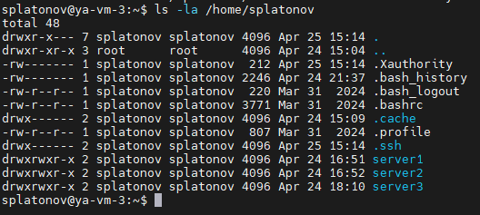
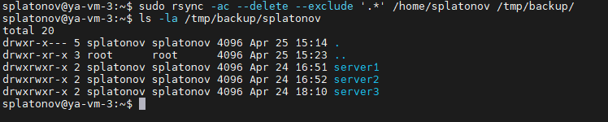
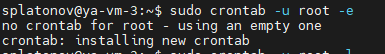
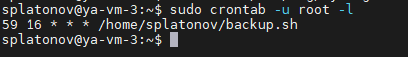
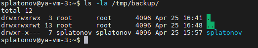

# Домашнее задание к занятию 3 «Резервное копирование» Платонов Станислав

## Задание 1

- Составьте команду rsync, которая позволяет создавать зеркальную копию домашней директории пользователя в директорию `/tmp/backup`
- Необходимо исключить из синхронизации все директории, начинающиеся с точки (скрытые)
- Необходимо сделать так, чтобы rsync подсчитывал хэш-суммы для всех файлов, даже если их время модификации и размер идентичны в источнике и приемнике.
- На проверку направить скриншот с командой и результатом ее выполнения


## Решение 1

- Проверим содержимое директории `home/splatonov` на наличие данных для резервного копирования:

```python
ls -la /home/splatonov
```



- Для получения зеркальной копии требуется использовать следующие атрибуты:
`--delete`, для удалении "лишних" файлов в директории назначения.
`--exclude` с параметром `'.*'` для исключения из синхронизации скрытых директорий
`-a` (archive mode) - комбинированный режим, который включает в себя рекурсивное копирование, сохранение символических ссылок, прав доступа, времени модификации, владельца и группы файлов - эквивалентно опциям -rlptgoD.
`-c` (checksum) - использует контрольные суммы для сравнения файлов вместо размера и времени модификации.
Команда для rsync будет выглядеть следующим образом:

```python
sudo rsync -ac --delete --exclude '.*' /home/splatonov /tmp/backup/
```

- Выполняем команду rsync и проверим содержимое директории назначения `/tmp/backup`:

```python
ls -la /tmp/backup/splatonov
```


Все необходимые директории (server1, server2, server3) с их содержимым были успешно скопированы. Другие файлы были исключены.

------

## Задание 2

- Написать скрипт и настроить задачу на регулярное резервное копирование домашней директории пользователя с помощью rsync и cron.
- Резервная копия должна быть полностью зеркальной
- Резервная копия должна создаваться раз в день, в системном логе должна появляться запись об успешном или неуспешном выполнении операции
- Резервная копия размещается локально, в директории `/tmp/backup`
- На проверку направить файл crontab и скриншот с результатом работы утилиты.


## Решение 2

- Создадим bash скрипт [backup.sh](backup.sh):

```python
SOURCE_DIR=/home/splatonov
DEST_DIR=/tmp/backup/
rsync -a --delete "$SOURCE_DIR" "$DEST_DIR" > /dev/null 2>&1
if [[ $? -eq 0 ]]
    then
       logger "Backup folder $SOURCE_DIR done"
    else 
       logger "Backup folder $SOURCE_DIR failed"
fi
```

1. Копируем содержимое домашней директории /home/splatonov в директорию /tmp/backup/ с помощью rsync
2. Используем опцию -a (archive) для сохранения всех атрибутов файлов
3. Используем опцию --delete для удаления файлов в целевой директории, которых нет в исходной (зеркальное копирование)
4. Записываем результат операции в системный лог с помощью команды logger

- Открываем crontab для редактирования:

```python
sudo crontab -u root -e
```

В редакторе nano (использую по умолчанию) задаем время и другие настройки шедулера а также пути к до исполняемого скрипта:

```json
59 16 * * * /home/splatonov/backup.sh
```
Объяснение формата cron:
1 - минута (0-59)
2 - час (0-23)
3 - день месяца (1-31)
4 - месяц (1-12)
5 - день недели (0-7, где 0 и 7 - воскресенье)
`*` - любое значение 



```python
sudo crontab -u root -l
```


- Проверяем директорию с резервной копией:

```python
ls -la /tmp/backup/
```


- Проверяем системный лог:


Скрипт по cron успешно отработал, о чем говорит запись в системном журнале.

------