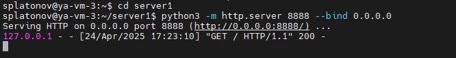
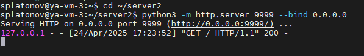
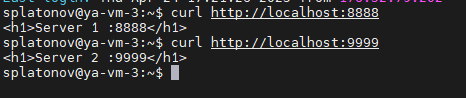
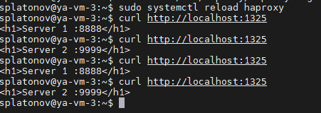
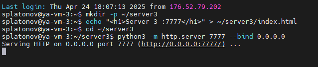
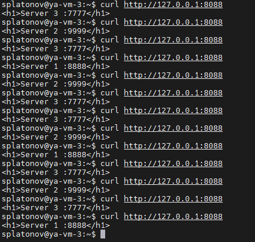
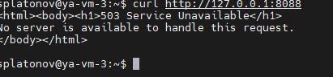
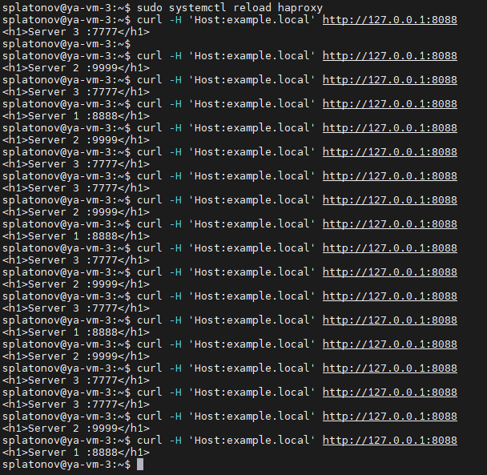
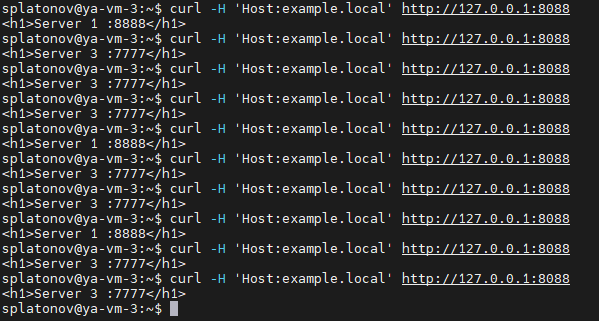

# Домашнее задание к занятию 2 «Кластеризация и балансировка нагрузки» Платонов Станислав

## Задание 1
- Запустите два simple python сервера на своей виртуальной машине на разных портах
- Установите и настройте HAProxy, воспользуйтесь материалами к лекции
- Настройте балансировку Round-robin на 4 уровне.
- На проверку направьте конфигурационный файл haproxy, скриншоты, где видно перенаправление запросов на разные серверы при обращении к HAProxy.


## Решение 1
- Создаем директорию для сервера 1
```python
mkdir -p ~/server1
echo "<h1>Server 1 :8888</h1>" > ~/server1/index.html
```
- Создаем директорию для сервера 2
```python
mkdir -p ~/server2
echo "<h1>Server 2 :9999</h1>" > ~/server2/index.html
```
- Запускаем сервер 1
```python
cd ~/server1
python3 -m http.server 8888 --bind 0.0.0.0
```

- Запускаем сервер 2
```python
cd ~/server2
python3 -m http.server 9999 --bind 0.0.0.0
```

- Проверяем работы серверов:
```python
curl http://localhost:8888
curl http://localhost:9999
```

Серверы работают корректно.
- Утанавливаем Haproxy
```python
sudo apt update
sudo apt-get install haproxy
```
- Редактируем конфигурационный файл HAProxy
```python
sudo nano /etc/haproxy/haproxy.cfg
```
Настраиваем HAProxy для прослушивания порта 1325 и распределения трафика между двумя серверами Python, используя балансировку round-robin на уровне 4 (TCP)
```json
listen web_tcp
    bind :1325
    server s1 127.0.0.1:8888 check inter 3s
    server s2 127.0.0.1:9999 check inter 3s
```
Конфигурационный файл [haproxy.cfg](haproxy.cfg)
Строка #default_backend web_servers закомментирована, так как не требуется для данного задания.
- Перезапускаем HAProxy
```python
sudo systemctl reload haproxy
```

- Проверяем работу haproxy на 4 уровне балансировки, направив 4 хапроса с помощью curl:
curl http://localhost:1325
Согласно конфигу для прверки балансировки на 4 уровне необходимо направить запрос на порт 1325

Балансировка успешно осуществляется.


------

## Задание 2
- Запустите три simple python сервера на своей виртуальной машине на разных портах
- Настройте балансировку Weighted Round Robin на 7 уровне, чтобы первый сервер имел вес 2, второй - 3, а третий - 4
- HAproxy должен балансировать только тот http-трафик, который адресован домену example.local
- На проверку направьте конфигурационный файл haproxy, скриншоты, где видно перенаправление запросов на разные серверы при обращении к HAProxy c использованием домена example.local и без него.


## Решение 2

- Создаем директорию для сервера 3
```python
mkdir -p ~/server3
echo "<h1>Server 3 :7777</h1>" > ~/server3/index.html
```

- Запускаем сервер 3
```python
cd ~/server3
python3 -m http.server 7777 --bind 0.0.0.0
```


- Настриваем haproxy.cfg:
раскомментируем строку #default_backend web_servers для настройки балансировки на 7 уровне и внесем корректировки в секцию бекенда:
```json
 backend web_servers    # секция бэкенд
        mode http
        balance roundrobin
        option httpchk
        http-check send meth GET uri /index.html
        server s1 127.0.0.1:8888 check weight 2
        server s2 127.0.0.1:9999 check weight 3
        server s3 127.0.0.1:7777 check weight 4
```
Конфигурационный файл [haproxy2.cfg](haproxy2.cfg)

- Проверяем балансировку roundrobin c парметром weight, отправляя запросы на порт фронтенда 8088:
```python
curl http://127.0.0.1:8088
```


- Выполняем настройку haproxy.cfg, чтобы использовать фильтр по хосту example.local:
```json
frontend example  # секция фронтенд
        mode http
        bind :8088
        #default_backend web_servers
	acl ACL_example.local hdr(host) -i example.local
	use_backend web_servers if ACL_example.local
```

- Проверяем работу балансировщика с запросами от имени хоста example.local:

1. Без указания хоста
```python
curl http://127.0.0.1:8088
```

Получаем ошибку 503

2. С указанием хоста
```python
curl -H 'Host:example.local' http://127.0.0.1:8088
```


- Отключаем сервер Server 2 :9999:



Запросы распределяются по доступным серверам.

------