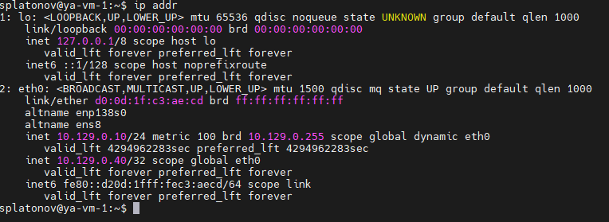

# Домашнее задание к занятию 1 «Disaster recovery и Keepalived» Платонов Станислав

## Задание 1
- Дана [схема](files/hsrp_advanced.pkt) для Cisco Packet Tracer, рассматриваемая в лекции.
- На данной схеме уже настроено отслеживание интерфейсов маршрутизаторов Gi0/1 (для нулевой группы)
- Необходимо аналогично настроить отслеживание состояния интерфейсов Gi0/0 (для первой группы).
- Для проверки корректности настройки, разорвите один из кабелей между одним из маршрутизаторов и Switch0 и запустите ping между PC0 и Server0.
- На проверку отправьте получившуюся схему в формате pkt и скриншот, где виден процесс настройки маршрутизатора.


### Решение 1

 [схема скорректированная](hsrp_corrected.pkt)


 ------

### Задание 2
- Запустите две виртуальные машины Linux, установите и настройте сервис Keepalived как в лекции, используя пример конфигурационного [файла](files/keepalived-simple.conf).
- Настройте любой веб-сервер (например, nginx или simple python server) на двух виртуальных машинах
- Напишите Bash-скрипт, который будет проверять доступность порта данного веб-сервера и существование файла index.html в root-директории данного веб-сервера.
- Настройте Keepalived так, чтобы он запускал данный скрипт каждые 3 секунды и переносил виртуальный IP на другой сервер, если bash-скрипт завершался с кодом, отличным от нуля (то есть порт веб-сервера был недоступен или отсутствовал index.html). Используйте для этого секцию vrrp_script
- На проверку отправьте получившейся bash-скрипт и конфигурационный файл keepalived, а также скриншот с демонстрацией переезда плавающего ip на другой сервер в случае недоступности порта или файла index.html


### Решение 2

- Устанавливаем njinx на обе VM
```python
sudo apt update
sudo apt install nginx -y
```


- Cоздаем index.html файлы на VM-1 и VM-2:
```python
echo "<h1>Welcome to VM</h1>" | sudo tee /server/index.html
```
```python
echo "<h1>Welcome to VM2</h1>" | sudo tee /server/index.html
```

- Создаем bash файл [check.sh](check.sh) на обеих VM

- Делаем скрипт исполняемым:

```python
chmod +x check.sh
```

- Перезапускаем njinx:
```python
sudo systemctl restart nginx
```

- Сервис njinx на VM-1 и VM-2:


- Устанавливаем keepalived
 

- Создаем [keepalived.conf](keepalivedm.conf) файл для MASTER
```python
sudo nano /etc/keepalived/keepalived.conf
```

- Создаем [keepalived.conf](keepalived.conf) файл для BACKUP
```python
sudo nano /etc/keepalived/keepalived.conf
```

- Запускаем keepalived
```python
sudo systemctl start keepalived
sudo systemctl enable keepalived
```
- Выполняем на VM1 (MASTER)
```python
ip addr
```


- Выполняем на VM2 (BACKUP)
```python
ip addr
```
------