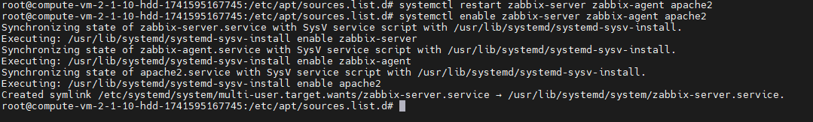
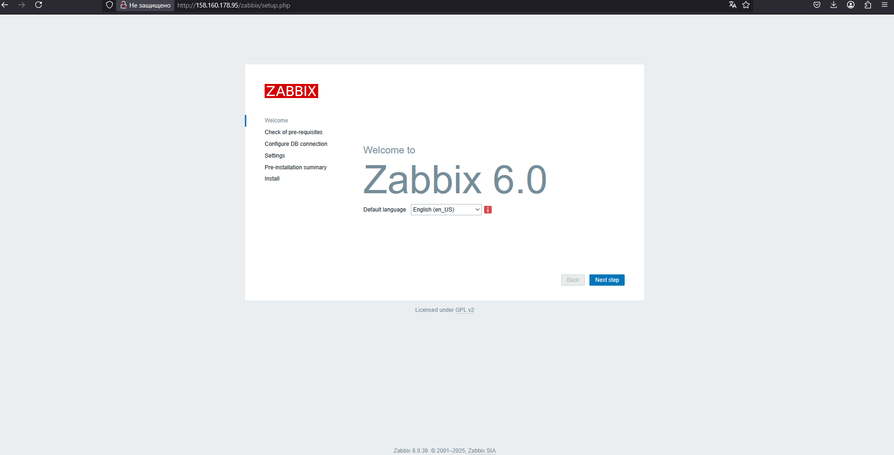

# Домашнее задание к занятию «Система мониторинга Zabbix»

---

### Задание 1 

Установите Zabbix Server с веб-интерфейсом.

#### Процесс выполнения
1. Выполняя ДЗ, сверяйтесь с процессом отражённым в записи лекции.
2. Установите PostgreSQL. Для установки достаточна та версия, что есть в системном репозитороии Debian 11.
3. Пользуясь конфигуратором команд с официального сайта, составьте набор команд для установки последней версии Zabbix с поддержкой PostgreSQL и Apache.
4. Выполните все необходимые команды для установки Zabbix Server и Zabbix Web Server.

#### Требования к результаты 
1. Прикрепите в файл Zabbix.md скриншот авторизации в админке.
2. Приложите в файл Zabbix.md текст использованных команд в GitHub.

### Решение 1


- Устанавливаем PostgreSQL:
```python
sudo apt install postgresql
```

- Добавляем репозиторий Zabbix:
```python
wget https://repo.zabbix.com/zabbix/6.0/ubuntu-arm64/pool/main/z/zabbix-release/zabbix-release_latest_6.0+ubuntu24.04_all.deb
pkg -i zabbix-release_latest_6.0+ubuntu24.04_all.deb
apt update 
```


- Устанавливаем Zabbix сервер, веб-интерфейс и агент:
```python
apt install zabbix-server-pgsql zabbix-frontend-php php8.3-pgsql zabbix-apache-conf zabbix-sql-scripts zabbix-agent
```

- Создаем пользователя БД:
```python
su - postgres -c 'psql --command "CREATE USER zabbix WITH PASSWORD
'\'123456789\'';"'
```

- Создаем БД:
```python
su - postgres -c 'psql --command "CREATE DATABASE zabbix OWNER zabbix;"'
```

- Импортируем схему и данные
```python
zcat /usr/share/zabbix-sql-scripts/postgresql/server.sql.gz | sudo -u zabbix psql zabbix 
```

- Настриваем подключение к БД (редактируем файл /etc/zabbix/zabbix_server.conf):
```python
sed -i 's/# DBPassword=/DBPassword=123456789/g' /etc/zabbix/zabbix_server.conf
```
или
```python
sudo nano /etc/zabbix/zabbix_server.conf
```

- Запускаем процессы Zabbix сервера и агента и настраиваем их запуск при загрузке ОС
```python
systemctl restart zabbix-server zabbix-agent apache2
systemctl enable zabbix-server zabbix-agent apache2 
```


- Настраиваем Web интерфейс (подключение к БД):
Указываем логин и паролья для БД, нажимаем далее..далее..
http://158.160.178.95/zabbix

Заходим в веб интерфейс вводим логин/пароль Admin\zabbix
http://158.160.178.95/zabbix


---

### Задание 2 

Установите Zabbix Agent на два хоста.

#### Процесс выполнения
1. Выполняя ДЗ, сверяйтесь с процессом отражённым в записи лекции.
2. Установите Zabbix Agent на 2 вирт.машины, одной из них может быть ваш Zabbix Server.
3. Добавьте Zabbix Server в список разрешенных серверов ваших Zabbix Agentов.
4. Добавьте Zabbix Agentов в раздел Configuration > Hosts вашего Zabbix Servera.
5. Проверьте, что в разделе Latest Data начали появляться данные с добавленных агентов.

#### Требования к результаты 
1. Приложите в файл README.md скриншот раздела Configuration > Hosts, где видно, что агенты подключены к серверу
2. Приложите в файл README.md скриншот лога zabbix agent, где видно, что он работает с сервером
3. Приложите в файл README.md скриншот раздела Monitoring > Latest data для обоих хостов, где видны поступающие от агентов данные.
4. Приложите в файл README.md текст использованных команд в GitHub

### Решение 2

- Добавляем репозиторий Zabbix:
```python
wget https://repo.zabbix.com/zabbix/6.0/ubuntu-arm64/pool/main/z/zabbix-release/zabbix-release_latest_6.0+ubuntu24.04_all.deb
pkg -i zabbix-release_latest_6.0+ubuntu24.04_all.deb
apt update 
```

- Устанавливаем только Zabbix агент:
```python
apt install zabbix-agent
```


- Запускаем процесс Zabbix агента и настраиваем запуск при загрузке ОС
```python
systemctl restart zabbix-agent
systemctl enable zabbix-agent
```


- Настраиваем работу сервера с агентом в веб веб интерфейсе:


- Проверяем логи на стороне агента:


```json
20481:20250324:141306.932 failed to accept an incoming connection: connection from "10.130.0.19" rejected, allowed hosts: "127.0.0.1"
```

- Настраиваем конфиг агента на удаленном хосте, указывая адрес сервера:

```python
sed -i 's/Server=127.0.0.1/Server=10.130.0.19'/g' /etc/zabbix/zabbix_agentd.conf
```
Ошибок в логе агента нет


- Итого настроен Zabbix сервер (Zabbix server) и два агента (локальный на том же хосте что и сервер и удаленный) - LocalVM и RemoteVM

Monitoring > Latest data

 
Configuration > Hosts


---