# Домашнее задание к занятию «Система мониторинга Zabbix. Часть 2»

### Задание 1
Создайте свой шаблон, в котором будут элементы данных, мониторящие загрузку CPU и RAM хоста.

#### Процесс выполнения
1. Выполняя ДЗ сверяйтесь с процессом отражённым в записи лекции.
2. В веб-интерфейсе Zabbix Servera в разделе Templates создайте новый шаблон
3. Создайте Item который будет собирать информацию об загрузке CPU в процентах
4. Создайте Item который будет собирать информацию об загрузке RAM в процентах

#### Требования к результату
- [ ] Прикрепите в файл README.md скриншот страницы шаблона с названием «Задание 1»

### Решение 1

- Переходим в Configuration > Templates > Create Template
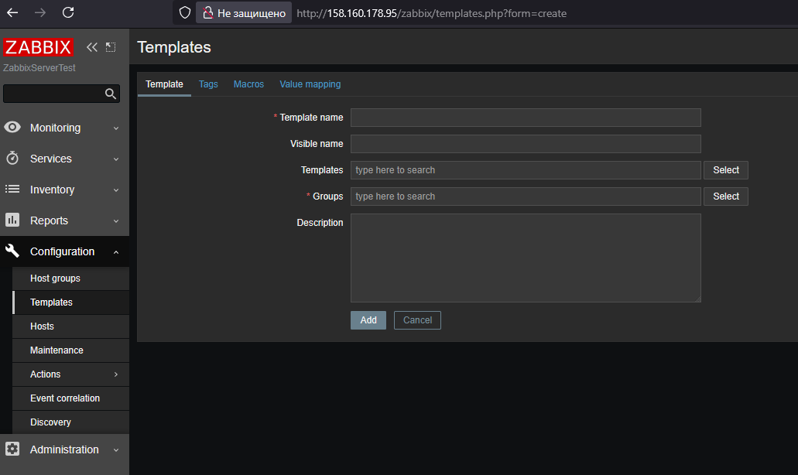

- Создаем новый шаблон и называем его CPU RAM Template
Прикрепляем шаблон CPU-RAM-Template к ещё несуществующей группе SystemData Templates
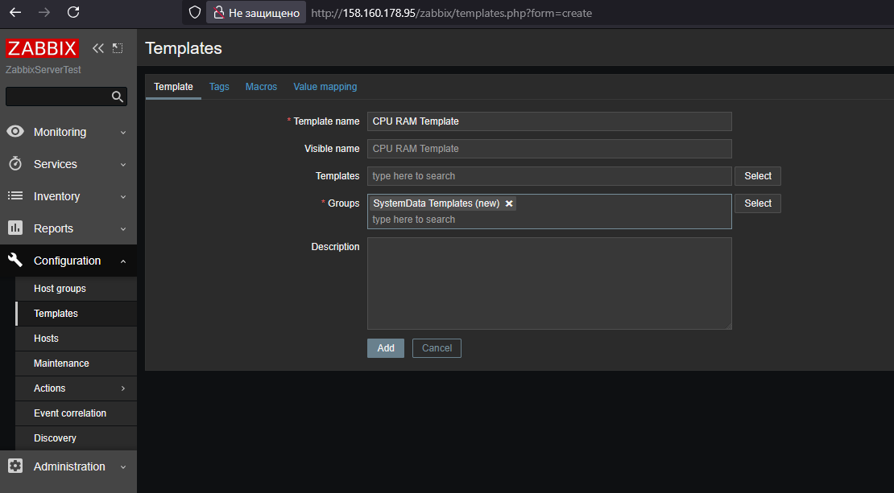

Шаблон успешно создан:
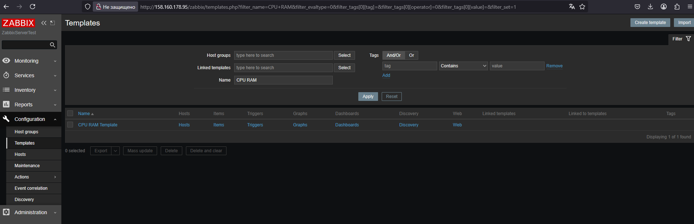

- Настраиваем CPU и RAM Items для шаблона CPU RAM Template:
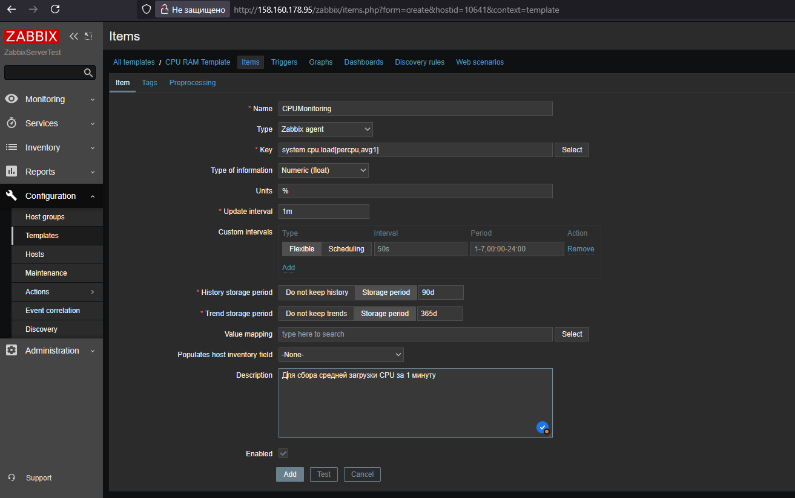
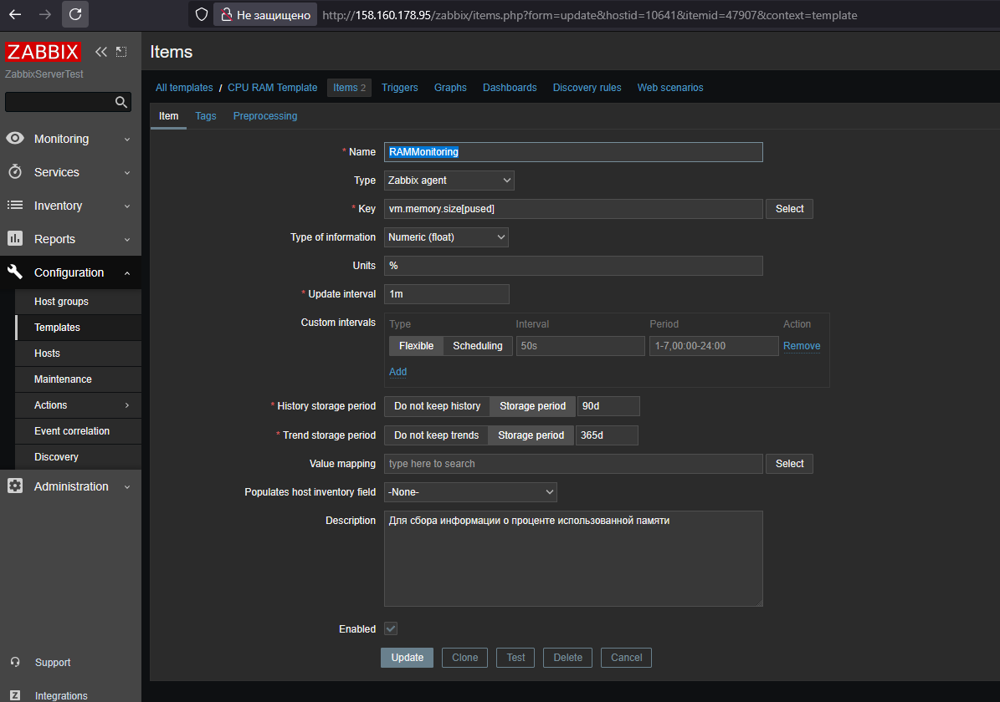
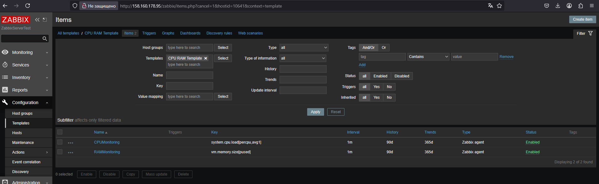

 ---

### Задание 2
Добавьте в Zabbix два хоста и задайте им имена.

#### Процесс выполнения
1. Выполняя ДЗ сверяйтесь с процессом отражённым в записи лекции.
2. Установите Zabbix Agent на 2 виртмашины, одной из них может быть ваш Zabbix Server
3. Добавьте Zabbix Server в список разрешенных серверов ваших Zabbix Agentов
4. Добавьте Zabbix Agentов в раздел Configuration > Hosts вашего Zabbix Servera
5. Прикрепите за каждым хостом шаблон Linux by Zabbix Agent
6. Проверьте что в разделе Latest Data начали появляться данные с добавленных агентов

#### Требования к результату
- [ ] Результат данного задания сдавайте вместе с заданием 3

### Решение 2

- Настроили 2 агента и связали их с zabbix server. 
Configuration > Hosts:
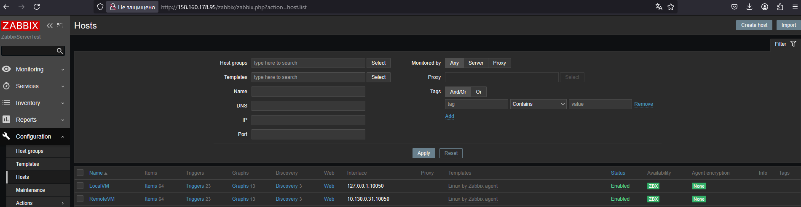
- Прикрепляем за каждым хостом шаблон Linux by Zabbix Agent:
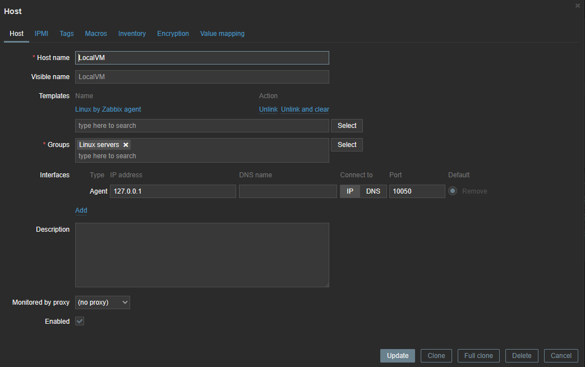
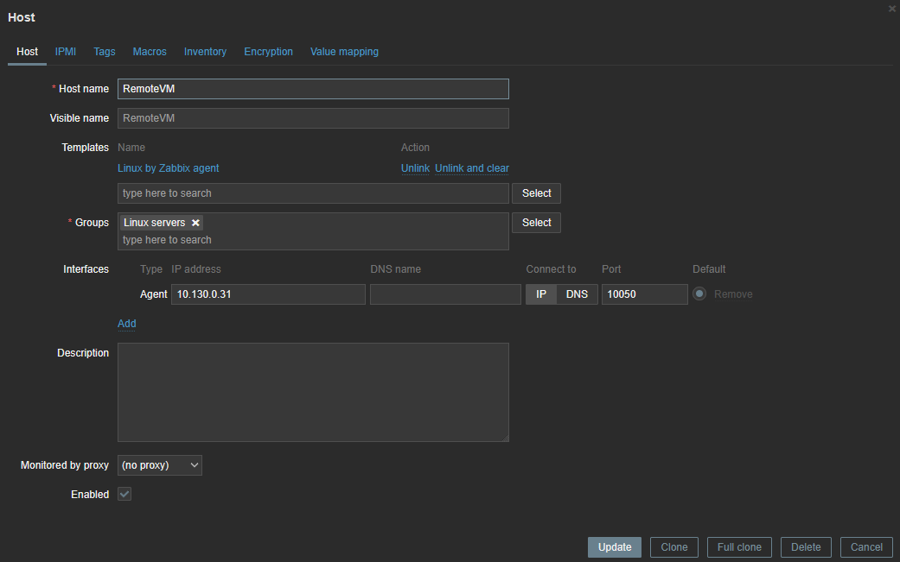

- В Latest Data начали появляться данные с добавленных агентов:
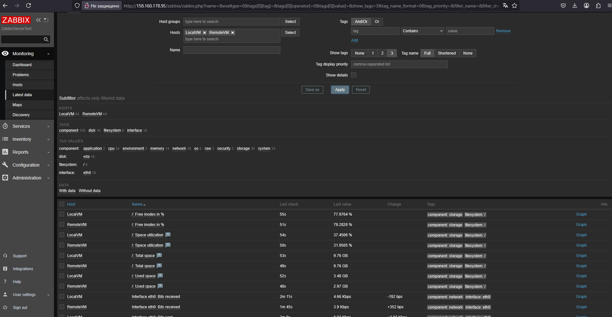

 ---

### Задание 3
Привяжите созданный шаблон к двум хостам. Также привяжите к обоим хостам шаблон Linux by Zabbix Agent.

#### Процесс выполнения
1. Выполняя ДЗ сверяйтесь с процессом отражённым в записи лекции.
2. Зайдите в настройки каждого хоста и в разделе Templates прикрепите к этому хосту ваш шаблон
3. Так же к каждому хосту привяжите шаблон Linux by Zabbix Agent
4. Проверьте что в раздел Latest Data начали поступать необходимые данные из вашего шаблона

#### Требования к результату
- [ ] Прикрепите в файл README.md скриншот страницы хостов, где будут видны привязки шаблонов с названиями «Задание 2-3». Хосты должны иметь зелёный статус подключения

### Решение 3

- В настройках каждого хоста в разделе Templates прикрепляем шаблон CPU RAM Template и шаблон Linux by Zabbix Agent:
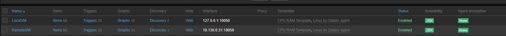

- В Latest Data начали появляться данные с привязанных шаблонов:
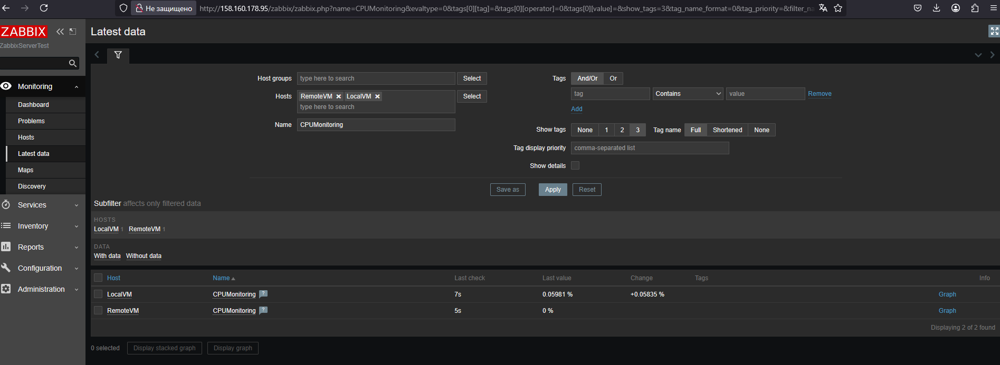
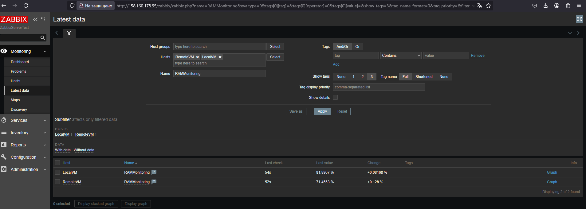

 ---

### Задание 4
Создайте свой кастомный дашборд.

#### Процесс выполнения
1. Выполняя ДЗ сверяйтесь с процессом отражённым в записи лекции.
2. В разделе Dashboards создайте новый дашборд
3. Разместите на нём несколько графиков на ваше усмотрение.

#### Требования к результату
- [ ] Прикрепите в файл README.md скриншот дашборда с названием «Задание 4»

### Решение 4

- В разделе Dashboards создаем новый дашборд My system Monitor
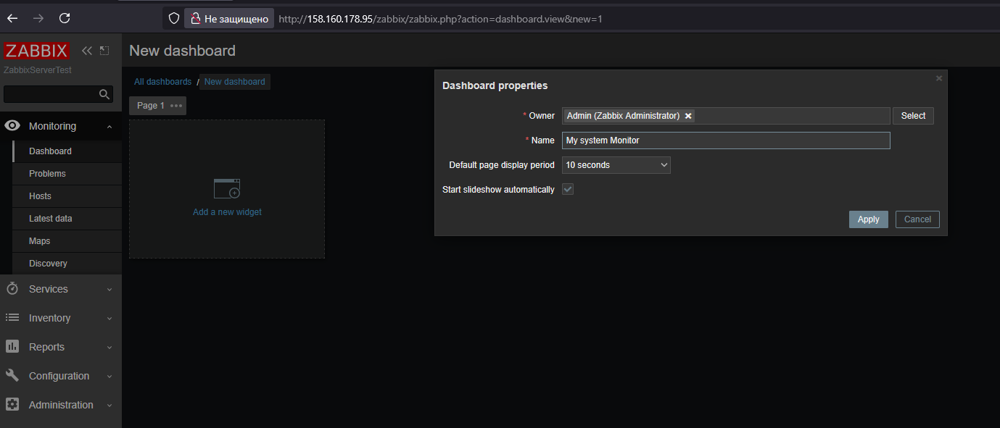
Размещаем виджеты
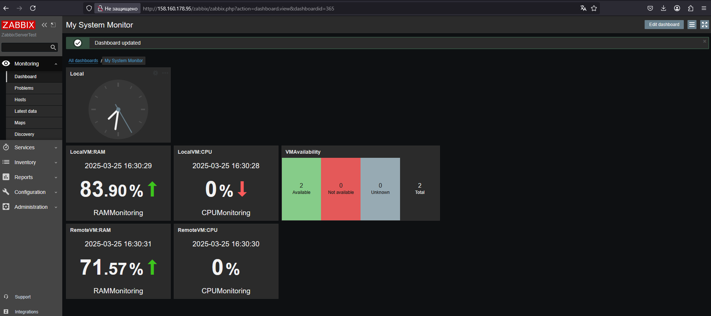

 ---