# Домашнее задание к занятию «Работа с данными (DDL/DML)»

---

Задание можно выполнить как в любом IDE, так и в командной строке.

### Задание 1
1.1. Поднимите чистый инстанс MySQL версии 8.0+. Можно использовать локальный сервер или контейнер Docker.

1.2. Создайте учётную запись sys_temp. 

1.3. Выполните запрос на получение списка пользователей в базе данных. (скриншот)

1.4. Дайте все права для пользователя sys_temp. 

1.5. Выполните запрос на получение списка прав для пользователя sys_temp. (скриншот)

1.6. Переподключитесь к базе данных от имени sys_temp.

Для смены типа аутентификации с sha2 используйте запрос: 
```sql
ALTER USER 'sys_test'@'localhost' IDENTIFIED WITH mysql_native_password BY 'password';
```
1.6. По ссылке https://downloads.mysql.com/docs/sakila-db.zip скачайте дамп базы данных.

1.7. Восстановите дамп в базу данных.

1.8. При работе в IDE сформируйте ER-диаграмму получившейся базы данных. При работе в командной строке используйте команду для получения всех таблиц базы данных. (скриншот)

*Результатом работы должны быть скриншоты обозначенных заданий, а также простыня со всеми запросами.*

### Решение 1

1.1. 
- Сервис MySQL поднят в виртуальной машине (vm5) на гипервизоре (lab) в локальной домашней сети.
Порт 
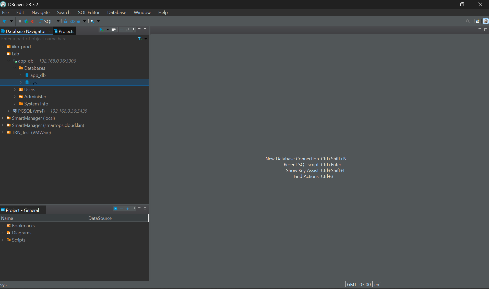
Порт 3306 для удобства подключения DBeaver проксируется из внутренней сети через haproxy 
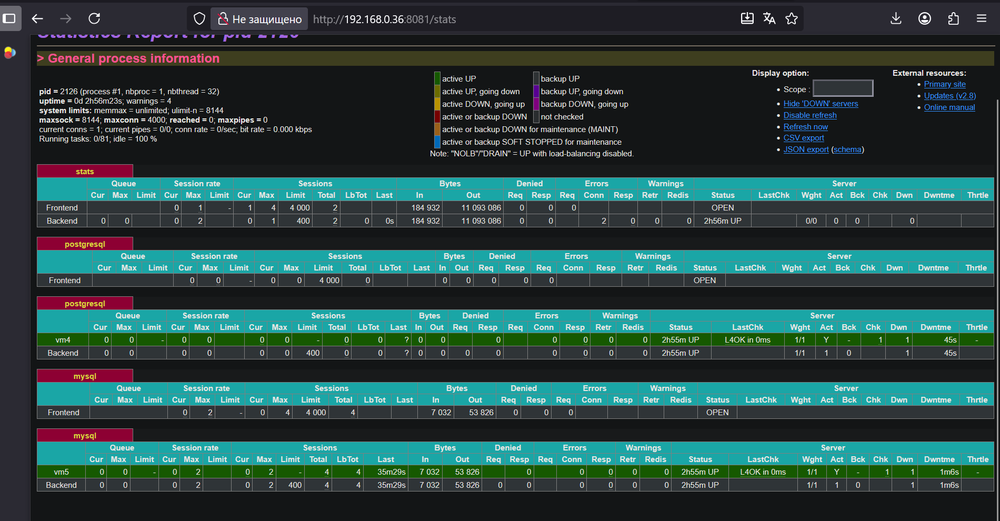 

1.2.
- Запрос создаст нового пользователя sys_temp, который сможет подключаться к серверу MySQL с любого хоста.
```sql
CREATE USER 'sys_temp'@'%' IDENTIFIED BY 'pswd321';
```
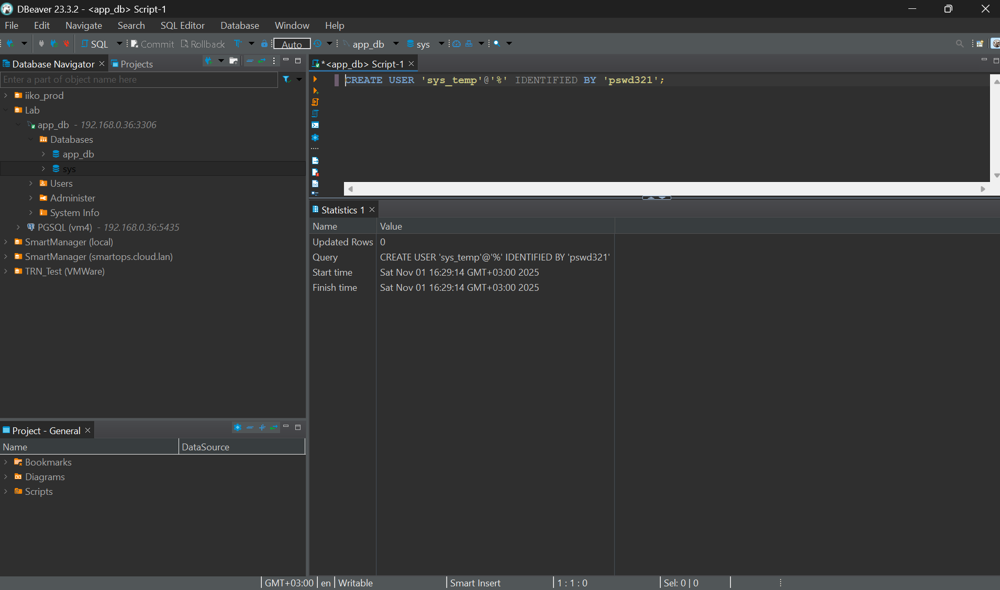

1.3.
- Запрос выведет таблицу с именами пользователей и хостами, с которых им разрешено подключаться.
```sql
SELECT user, host FROM mysql.user;
```
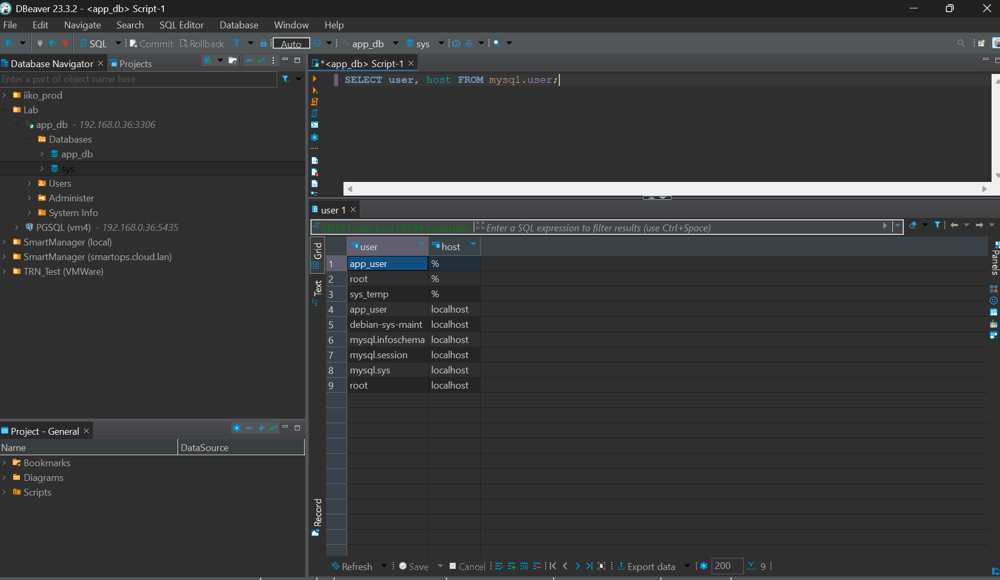

1.4.
- Запрос предоставляет все возможные привилегии пользователю sys_temp. Опция WITH GRANT OPTION позволяет этому пользователю также предоставлять права другим пользователям.
```sql
GRANT ALL PRIVILEGES ON *.* TO 'sys_temp'@'%' WITH GRANT OPTION;
```
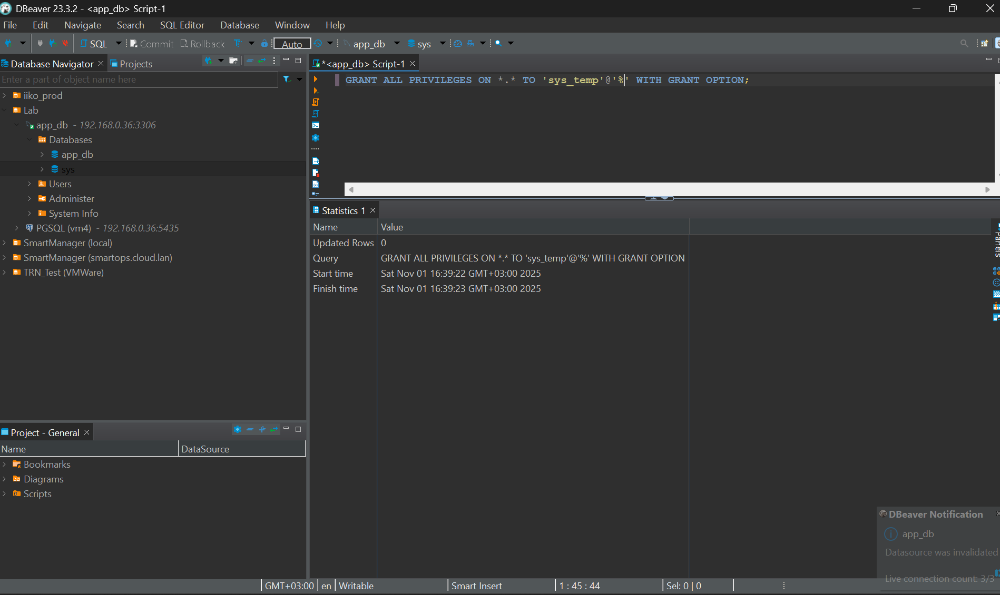
необходимо обновить привилегии:
```sql
FLUSH PRIVILEGES;
```

1.5.
- Запроса покажет все привилегии, которые были назначены пользователю.
```sql
SHOW GRANTS FOR 'sys_temp'@'%';
```
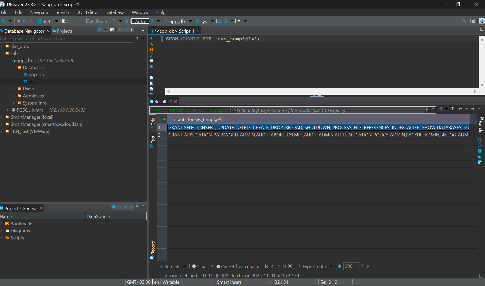

1.6.
- Меняем метод аутентификации пользователя (серверный метод):
```sql
ALTER USER 'sys_temp'@'%' IDENTIFIED WITH mysql_native_password BY 'pswd321';
```
- Переключаем пользователя:
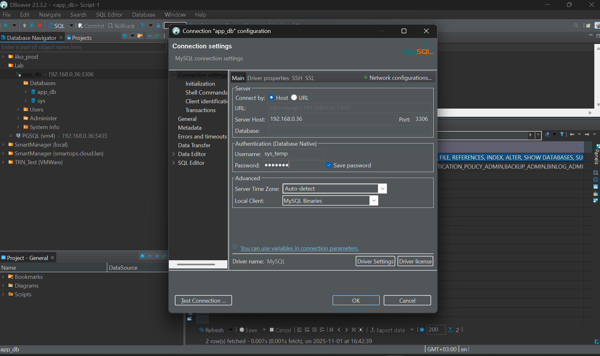
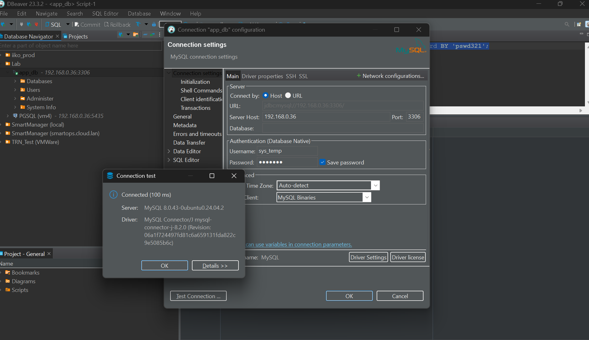

1.7.
- Создаем БД для восстановления:
```sql
CREATE DATABASE sakila;
```
- tools -> execute script -> sakila-schema.sql
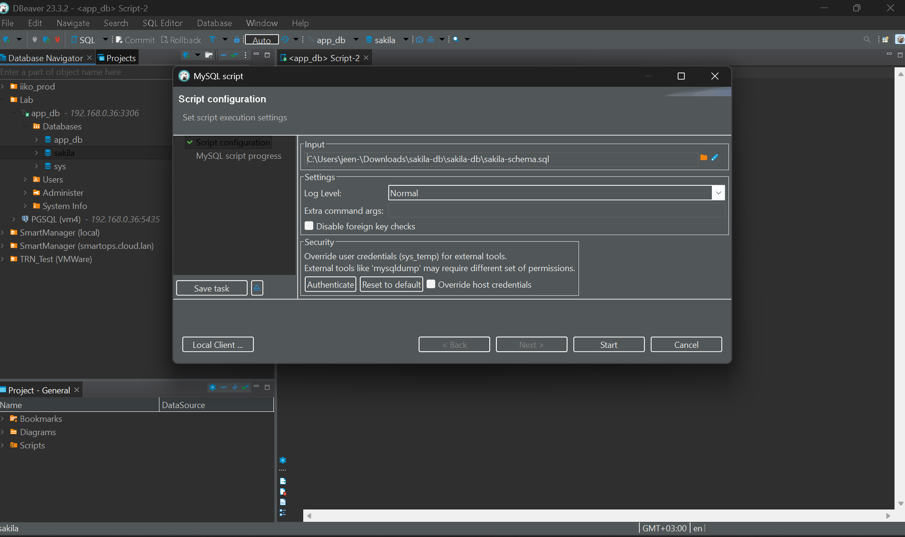
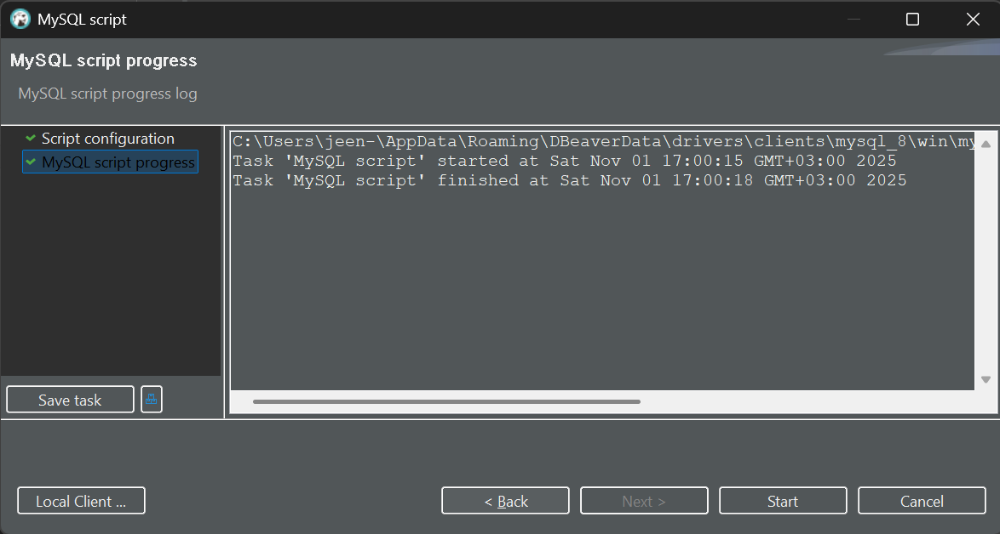
- tools -> execute script -> sakila-data.sql
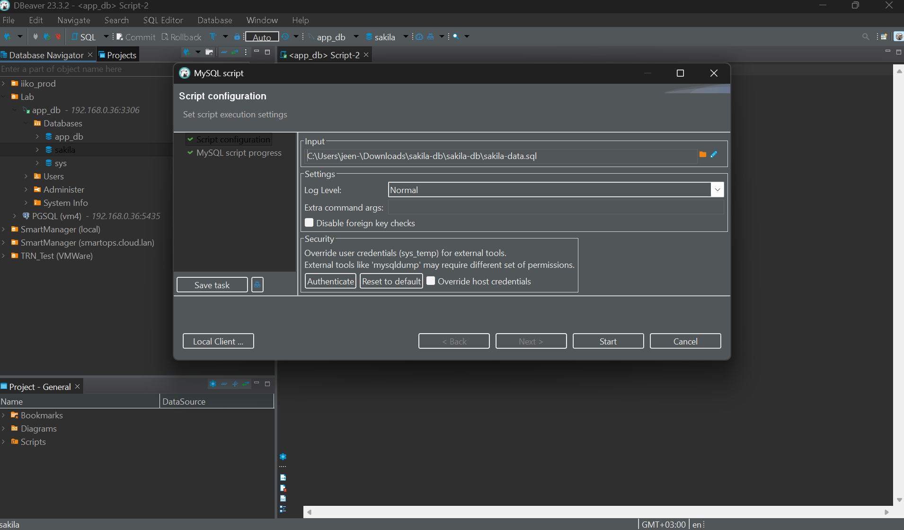
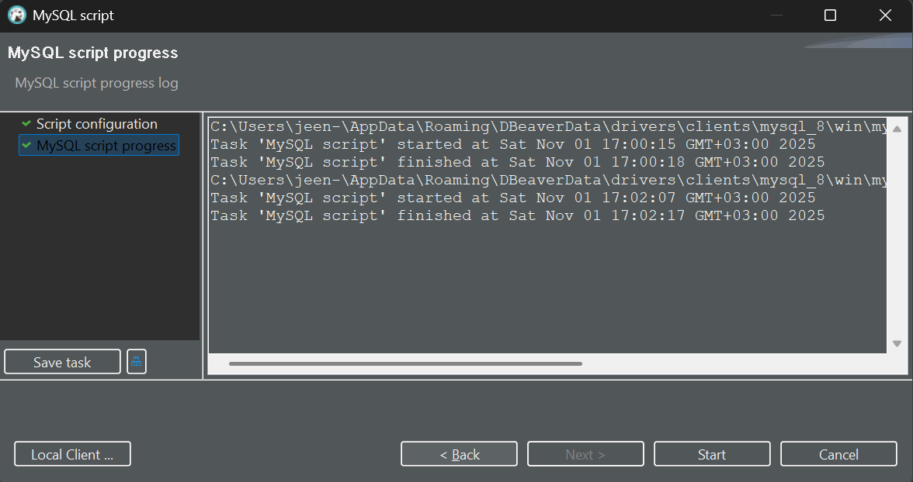

1.8.
- ER-диаграмма для визуализации структуры созданной БД sakila:
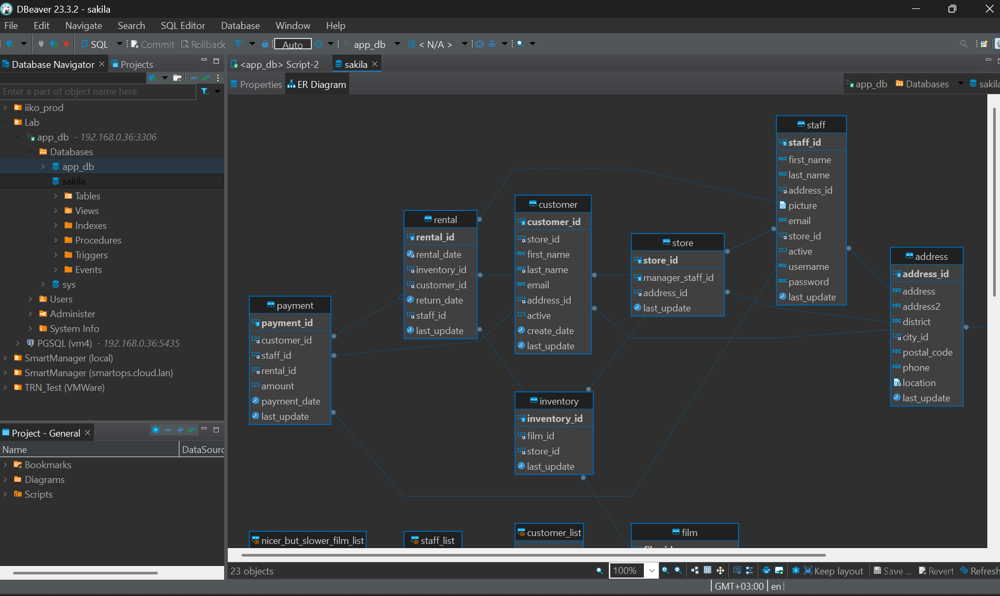


### Задание 2
Составьте таблицу, используя любой текстовый редактор или Excel, в которой должно быть два столбца: в первом должны быть названия таблиц восстановленной базы, во втором названия первичных ключей этих таблиц. Пример: (скриншот/текст)
```
Название таблицы | Название первичного ключа
customer         | customer_id
```
### Решение 2
- Запос обращается к системной информации базы данных (information_schema) и извлекает нужные данные:

```sql
SELECT
    t.TABLE_NAME AS 'Название таблицы',
    k.COLUMN_NAME AS 'Название первичного ключа'
FROM
    information_schema.TABLE_CONSTRAINTS t
JOIN
    information_schema.KEY_COLUMN_USAGE k
        USING(CONSTRAINT_NAME, TABLE_SCHEMA, TABLE_NAME)
WHERE
    t.CONSTRAINT_TYPE = 'PRIMARY KEY'
    AND t.TABLE_SCHEMA = 'sakila';
```
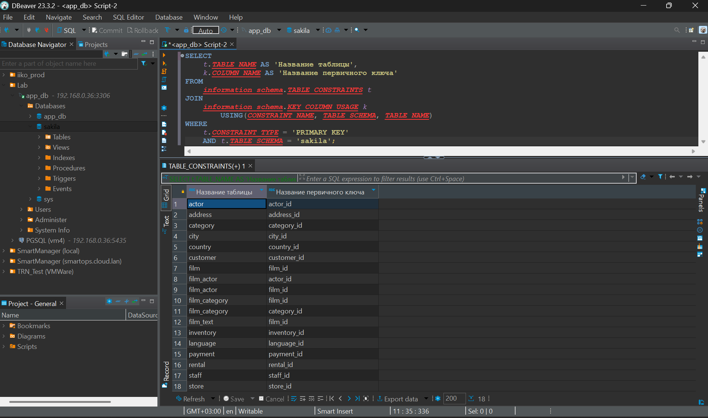

```
Название таблицы | Название первичного ключа
actor |	actor_id
address |	address_id
category |	category_id
city |	city_id
country |	country_id
customer |	customer_id
film |	film_id
film_actor |	actor_id
film_actor |	film_id
film_category |	film_id
film_category |	category_id
film_text |	film_id
inventory |	inventory_id
language |	language_id
payment |	payment_id
rental |	rental_id
staff |	staff_id
store |	store_id
```