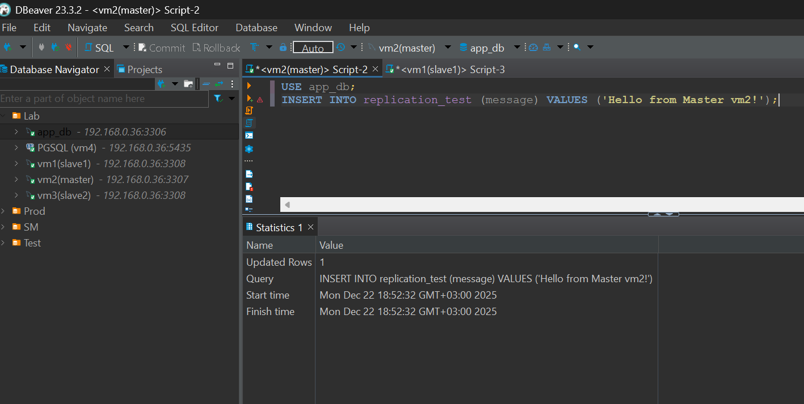
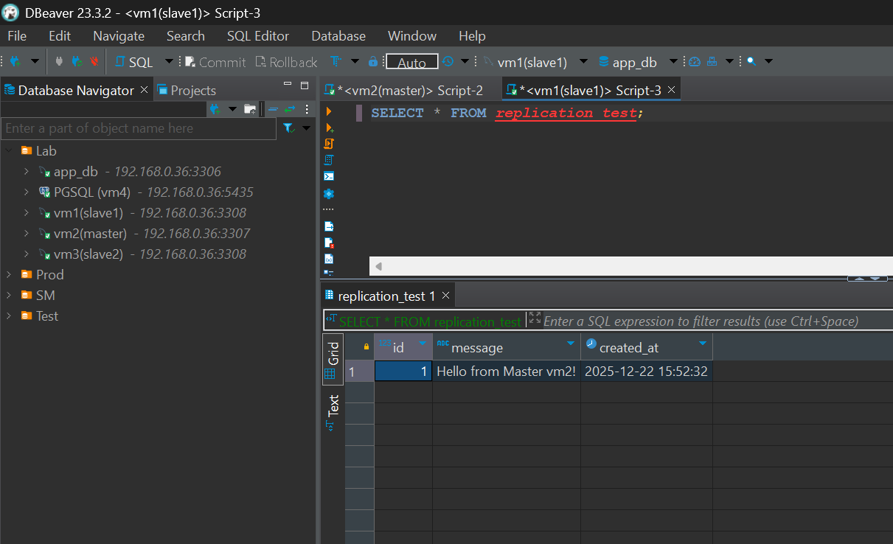
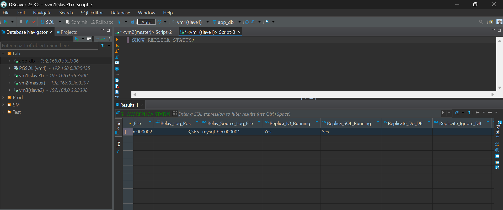
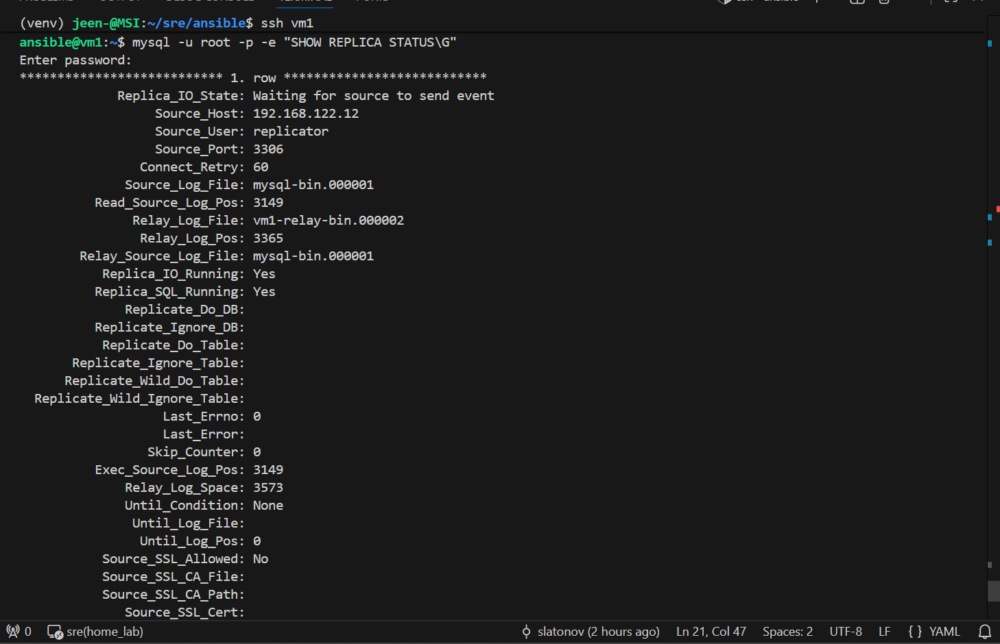
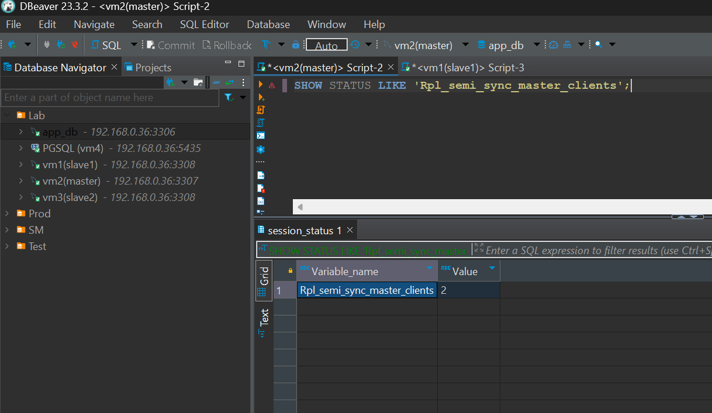
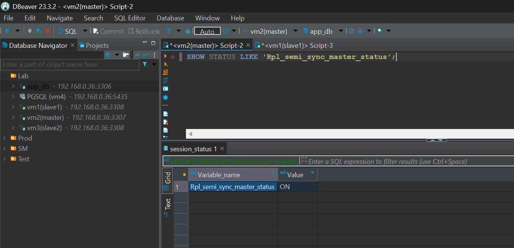

# Домашнее задание к занятию «Репликация и масштабирование. Часть 1»

### Задание 1

На лекции рассматривались режимы репликации master-slave, master-master, опишите их различия.

*Ответить в свободной форме.*

### Решение 1

Основное различие между режимами master-slave и master-master заключается в направлении потока данных и возможности выполнять операции записи (INSERT/UPDATE/DELETE).

1. Master-Slave

Классическая схема. Используется в продакшен среде чаше всего.

Есть главный сервер (Master), который принимает все изменения в БД и один или несколько подчиненных серверов (Slave), которые получают изменения от мастера и применяют их у себя.

Запись: Только на Master. Если попытаться записать на Slave (при стандартных настройках read_only), сервер выдаст ошибку.

Чтение: Можно читать и с Master, и со Slave. Обычно чтение распределяют на слейвы, чтобы разгрузить мастер.Направление репликации: Одностороннее (Master → Slave).

Плюсы: Простота настройки, отсутствие конфликтов данных (так как источник правды один), легкое масштабирование на чтение (просто добавляем слейвы).

Минусы: Мастер — единая точка отказа (SPOF). Если мастер падает, запись в базу невозможна, пока администратор или автоматика не повысит один из слейвов до нового мастера.

2. Master-Master

Более сложная схема, где два (или более) сервера являются равноправными.

Каждый сервер считает себя Мастером. Сервер А реплицирует данные на Сервер Б, а Сервер Б реплицирует данные на Сервер А.

Запись: Можно писать на любой из серверов.

Чтение: Можно читать с любого сервера.

Направление репликации: Двустороннее (А ↔ Б) или кольцевое (если серверов больше двух).

Плюсы: Высокая доступность на запись (если один сервер упал, приложение просто пишет во второй).

Минусы: Конфликты данных. Если одновременно на двух серверах изменить одну и ту же строку, возникнет конфликт, который репликация сама не решит.
Сложность настройки.

---

### Задание 2

Выполните конфигурацию master-slave репликации, примером можно пользоваться из лекции.

*Приложите скриншоты конфигурации, выполнения работы: состояния и режимы работы серверов.*


### Решение 2

Ввиду того что асинхронная репликация (используется по умолчанию) при в схеме Master-Slave может "отставать" от мастера и на практике не всегда актуальна ниже приведу пример настройки полусинхронной репликации для MySQL с одним Master и двумя Slave нодами.
В качестве нод используются виртуальные машины vm1, vm2, vm3:

vms:
  - name: "vm1"              # slave1
    ip: "192.168.122.11/24"
    vm_vcpus: 2
    vm_ram_mb: 2048
    disk_size: "20G"
  - name: "vm2"              # master
    ip: "192.168.122.12/24"
    vm_vcpus: 2
    vm_ram_mb: 4096
    disk_size: "20G"
  - name: "vm3"              # slave2
    ip: "192.168.122.13/24"
    vm_vcpus: 2
    vm_ram_mb: 2048
    disk_size: "20G"

Для простоты настройки трех vm написал роль для ansible, которую прикладываю к заданию.


Репликация Master-Slave настроена следующим образом:

- vm2 настраивается как Master.
- vm1 и vm3 настраиваются как Slaves.
- Включается GTID (современный стандарт репликации).
- Включаются плагины Semi-Sync.
- На мастере выставляется ожидание одного слейва (rpl_semi_sync_master_wait_for_slave_count = 1).

1. Проверяем работу на Мастере:

- Создаем таблицу для проверки на мастере:
```python
USE app_db; 
CREATE TABLE IF NOT EXISTS replication_test (
    id INT AUTO_INCREMENT PRIMARY KEY,
    message VARCHAR(255) NOT NULL,
    created_at TIMESTAMP DEFAULT CURRENT_TIMESTAMP
);
```
- вставляем в таблицу проверочную запись:
```python
USE app_db; 
INSERT INTO replication_test (message) VALUES ('Hello from Master vm2!');
```


- таблица и проверочная запись успешно созданы

2. Проверка данных на Слейве

- Смотрим запросом пришли данные с мастера на слейв:
```python
SELECT * FROM replication_test;
```



3. Проверка статуса репликации на Слейве

- Смотрим запросом статус репликации:
```python
SHOW REPLICA STATUS;
```


- репликация настроена и работает

Также можно проверить непосредственно на vm1:
mysql -u root -p -e "SHOW REPLICA STATUS\G"


4. Проверка Semi-Sync на Мастере

- Убеждаемся что работает полусинхронная репликация и выполняем запросы на мастере:
```python
SHOW STATUS LIKE 'Rpl_semi_sync_master_clients';
```


- 2, так как оба слейва vm1 и vm3 подключены к мастеру.
```python
SHOW STATUS LIKE 'Rpl_semi_sync_master_status';
```


-  ON, так как включен semi_sync.

---
