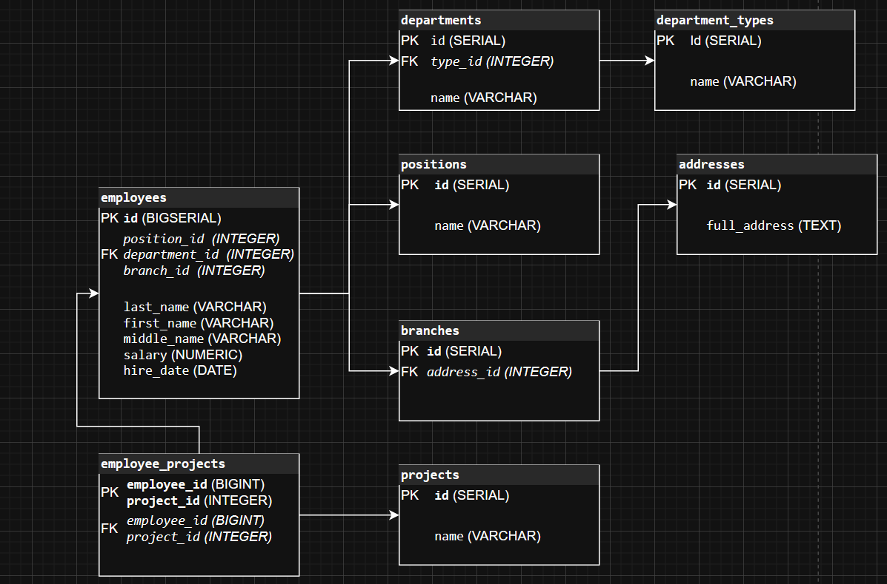

# Домашнее задание к занятию «Базы данных»

---

### Легенда

Заказчик передал вам [файл в формате Excel](https://github.com/netology-code/sdb-homeworks/blob/main/resources/hw-12-1.xlsx), в котором сформирован отчёт. 

На основе этого отчёта нужно выполнить следующие задания.

### Задание

Опишите не менее семи таблиц, из которых состоит база данных. Определите:

- какие данные хранятся в этих таблицах,
- какой тип данных у столбцов в этих таблицах, если данные хранятся в PostgreSQL.

Начертите схему полученной модели данных. Можете использовать онлайн-редактор: https://app.diagrams.net/

Этапы реализации:
1.	Внимательно изучите предоставленный вам файл с данными и подумайте, как можно сгруппировать данные по смыслу.
2.	Разбейте исходный файл на несколько таблиц и определите список столбцов в каждой из них. 
3.	Для каждого столбца подберите подходящий тип данных из PostgreSQL. 
4.	Для каждой таблицы определите первичный ключ (PRIMARY KEY).
5.	Определите типы связей между таблицами. 
6.	Начертите схему модели данных.
На схеме должны быть чётко отображены:
   - все таблицы с их названиями,
   - все столбцы  с указанием типов данных,
   - первичные ключи (они должны быть явно выделены),
   - линии, показывающие связи между таблицами.

**Результатом выполнения задания** должен стать скриншот получившейся схемы базы данных.

## Дополнительные задания (со звёздочкой*)
Эти задания дополнительные, то есть не обязательные к выполнению. Вы можете их выполнить, если хотите глубже и шире разобраться в материале.

### Задание 2*

1. Разверните СУБД Postgres на своей хостовой машине, на виртуальной машине или в контейнере docker.
2. Опишите схему, полученную в предыдущем задании, с помощью скрипта SQL.
3. Создайте в вашей полученной СУБД новую базу данных и выполните полученный ранее скрипт для создания вашей модели данных.

В качестве решения приложите SQL скрипт и скриншот диаграммы.

Для написания и редактирования sql удобно использовать  специальный инструмент dbeaver.

### Решение 1

Схема модели данных:

1. Таблица employees (Сотрудники)

Таблица хранит основную информацию о каждом сотруднике.

    Назначение: Хранение персональных и кадровых данных сотрудников.
    Данные:
        id: Уникальный идентификатор сотрудника.
        last_name: Фамилия (из поля "ФИО сотрудника").
        first_name: Имя (из поля "ФИО сотрудника").
        middle_name: Отчество (из поля "ФИО сотрудника"), может отсутствовать.
        salary: Оклад сотрудника (из поля "Оклад").
        hire_date: Дата приёма на работу.
        position_id: Внешний ключ, связывающий сотрудника с его должностью в таблице positions.
        department_id: Внешний ключ, связывающий сотрудника с его подразделением в таблице departments.
        branch_id: Внешний ключ, связывающий сотрудника с филиалом, в котором он работает, в таблице branches.
    Типы данных в PostgreSQL:
        id: BIGSERIAL PRIMARY KEY — автоинкрементируемый первичный ключ.
        last_name: VARCHAR(100) NOT NULL — фамилия.
        first_name: VARCHAR(100) NOT NULL — имя.
        middle_name: VARCHAR(100) — отчество.
        salary: NUMERIC(12, 2) NOT NULL — оклад, с точностью до двух знаков после запятой.
        hire_date: DATE NOT NULL — дата найма.
        position_id: INTEGER REFERENCES positions(id) NOT NULL — ссылка на должность.
        department_id: INTEGER REFERENCES departments(id) NOT NULL — ссылка на подразделение.
        branch_id: INTEGER REFERENCES branches(id) NOT NULL — ссылка на филиал.

2. Таблица positions (Должности)

Справочник должностей для избежания дублирования и ошибок.

    Назначение: Хранение уникальных наименований должностей.
    Данные:
        id: Уникальный идентификатор должности.
        name: Название должности (например, "ведущий QA инженер", "специалист").
    Типы данных в PostgreSQL:
        id: SERIAL PRIMARY KEY — автоинкрементируемый первичный ключ.
        name: VARCHAR(255) NOT NULL UNIQUE — уникальное название должности.

3. Таблица department_types (Типы подразделений)

Справочник для типов подразделений.

    Назначение: Хранение типов структурных подразделений.
    Данные:
        id: Уникальный идентификатор типа.
        name: Название типа (например, "Отдел", "Группа", "Департамент").
    Типы данных в PostgreSQL:
        id: SERIAL PRIMARY KEY.
        name: VARCHAR(100) NOT NULL UNIQUE.

4. Таблица departments (Структурные подразделения)

Таблица для хранения информации о конкретных подразделениях.

    Назначение: Хранение названий структурных подразделений и их типов.
    Данные:
        id: Уникальный идентификатор подразделения.
        name: Название подразделения ("Центр компетенций QA Москва").
        type_id: Внешний ключ, связывающий подразделение с его типом в таблице department_types.
    Типы данных в PostgreSQL:
        id: SERIAL PRIMARY KEY.
        name: VARCHAR(255) NOT NULL UNIQUE.
        type_id: INTEGER REFERENCES department_types(id) NOT NULL.

5. Таблица addresses (Адреса)

Справочник адресов для филиалов.

    Назначение: Хранение уникальных адресов филиалов.
    Данные:
        id: Уникальный идентификатор адреса.
        full_address: Полная строка адреса ("Приморский край, г. Владивосток, ул Нижнепортовая, д. 1").
    Типы данных в PostgreSQL:
        id: SERIAL PRIMARY KEY.
        full_address: TEXT NOT NULL UNIQUE.

6. Таблица branches (Филиалы)

Таблица, связывающая адрес с понятием "филиал".

    Назначение: Учёт физических филиалов компании.
    Данные:
        id: Уникальный идентификатор филиала.
        address_id: Внешний ключ, связывающий филиал с его адресом в таблице addresses.
    Типы данных в PostgreSQL:
        id: SERIAL PRIMARY KEY.
        address_id: INTEGER REFERENCES addresses(id) NOT NULL UNIQUE.

7. Таблица projects (Проекты)

Справочник всех проектов компании.

    Назначение: Хранение уникальных наименований проектов.
    Данные:
        id: Уникальный идентификатор проекта.
        name: Название проекта ("Итэлма Инженерный корпус", "Севастополь ТВ").
    Типы данных в PostgreSQL:
        id: SERIAL PRIMARY KEY.
        name: VARCHAR(255) NOT NULL UNIQUE.

8. Таблица employee_projects (Сотрудники на проектах)

Связующая таблица для реализации отношения "многие-ко-многим" между сотрудниками и проектами.

    Назначение: Указание, какой сотрудник на какой проект назначен.
    Данные:
        employee_id: Внешний ключ на сотрудника.
        project_id: Внешний ключ на проект.
    Типы данных в PostgreSQL:
        employee_id: BIGINT REFERENCES employees(id).
        project_id: INTEGER REFERENCES projects(id).
        PRIMARY KEY (employee_id, project_id) — составной первичный ключ для обеспечения уникальности пары "сотрудник-проект".

На основе описанных таблиц строим следующую схему.

- department_types

    id (SERIAL, PK)
    name (VARCHAR)

- departments

    id (SERIAL, PK)
    name (VARCHAR)
    type_id (INTEGER, FK -> department_types.id)

- positions

    id (SERIAL, PK)
    name (VARCHAR)

- addresses

    id (SERIAL, PK)
    full_address (TEXT)

- branches

    id (SERIAL, PK)
    address_id (INTEGER, FK -> addresses.id)

- employees

    id (BIGSERIAL, PK)
    last_name (VARCHAR)
    first_name (VARCHAR)
    middle_name (VARCHAR)
    salary (NUMERIC)
    hire_date (DATE)
    position_id (INTEGER, FK -> positions.id)
    department_id (INTEGER, FK -> departments.id)
    branch_id (INTEGER, FK -> branches.id)

- projects

    id (SERIAL, PK)
    name (VARCHAR)

- employee_projects

    employee_id (BIGINT, PK, FK -> employees.id)
    project_id (INTEGER, PK, FK -> projects.id)

Визуальная схема (для diagrams.net):

---