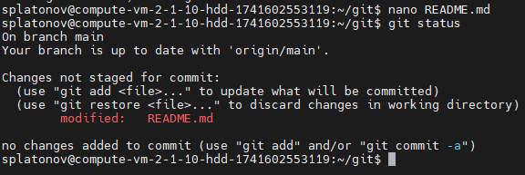
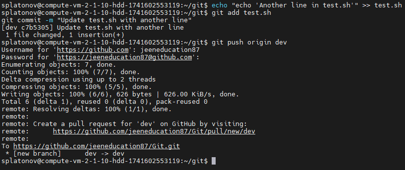
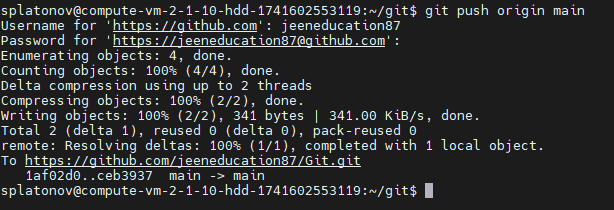

# Домашнее задание к занятию "`Домашнее задание к занятию «Git»`" - `Платонов Станислав`


### Инструкция по выполнению домашнего задания

   1. Сделайте `fork` данного репозитория к себе в Github и переименуйте его по названию или номеру занятия, например, https://github.com/имя-вашего-репозитория/git-hw или  https://github.com/имя-вашего-репозитория/7-1-ansible-hw).
   2. Выполните клонирование данного репозитория к себе на ПК с помощью команды `git clone`.
   3. Выполните домашнее задание и заполните у себя локально этот файл README.md:
      - впишите вверху название занятия и вашу фамилию и имя
      - в каждом задании добавьте решение в требуемом виде (текст/код/скриншоты/ссылка)
      - для корректного добавления скриншотов воспользуйтесь [инструкцией "Как вставить скриншот в шаблон с решением](https://github.com/netology-code/sys-pattern-homework/blob/main/screen-instruction.md)
      - при оформлении используйте возможности языка разметки md (коротко об этом можно посмотреть в [инструкции  по MarkDown](https://github.com/netology-code/sys-pattern-homework/blob/main/md-instruction.md))
   4. После завершения работы над домашним заданием сделайте коммит (`git commit -m "comment"`) и отправьте его на Github (`git push origin`);
   5. Для проверки домашнего задания преподавателем в личном кабинете прикрепите и отправьте ссылку на решение в виде md-файла в вашем Github.
   6. Любые вопросы по выполнению заданий спрашивайте в чате учебной группы и/или в разделе “Вопросы по заданию” в личном кабинете.
   
Желаем успехов в выполнении домашнего задания!
   
### Дополнительные материалы, которые могут быть полезны для выполнения задания

1. [Руководство по оформлению Markdown файлов](https://gist.github.com/Jekins/2bf2d0638163f1294637#Code)

---

### Задание 1


**Что нужно сделать:**

1. Зарегистрируйте аккаунт на [GitHub](https://github.com/).
1. Создайте  **новый отдельный публичный репозиторий**. Обязательно поставьте галочку в поле «Initialize this repository with a README».
2. Склонируйте репозиторий, используя https протокол `git clone ...`.
3. Перейдите в каталог с клоном репозитория.
1. Произведите первоначальную настройку Git, указав своё настоящее имя и email: `git config --global user.name` и `git config --global user.email johndoe@example.com`.
1. Выполните команду `git status` и запомните результат.
1. Отредактируйте файл README.md любым удобным способом, переведя файл в состояние Modified.
1. Ещё раз выполните `git status` и продолжайте проверять вывод этой команды после каждого следующего шага.
1. Посмотрите изменения в файле README.md, выполнив команды `git diff` и `git diff --staged`.
1. Переведите файл в состояние staged или, как говорят, добавьте файл в коммит, командой `git add README.md`.
1. Ещё раз выполните команды `git diff` и `git diff --staged`.
1. Теперь можно сделать коммит `git commit -m 'First commit'`.
1. Сделайте `git push origin master`.

В качестве ответа добавьте ссылку на этот коммит в ваш md-файл с решением.

### Решение 1

- Создаем публичный репозиторий 

https://github.com/jeeneducation87/Git.

- Клонируем репозиторий к себе на ПК в директорию git
```python
git clone https://github.com/jeeneducation87/Git.git git
```


- Переходим в директорию с репозиторием git

```python
cd /home/splatonov/git/
```

- Выполняем первоначальную настройку git

```python
git config --global user.name "splatonov"
git config --global user.email jeeneducation87@gmail.com
```


- Выполняем `git status` и запоминаем результат
Рабочая директория чиста, так как ничего не изменяли


- Редактируем файл README.md и повторно проверяем `git status`
Файл README.md находится в состоянии Modified.



- Смотрим изменения в файле README.md `git diff`
Команда выводит изменения, которые внесли в файл


- Переводим файл в состояние staged `git add README.md` и еще раз выполняем `git diff`:
На этот раз git diff не покажет изменений, так как они уже добавлены в индекс.


- Выполняем `git diff --staged`
Эта команда покажет изменения, которые будут включены в следующий коммит.


- Делаем коммит

```python
git commit -m "First commit"
```


- Делаем `git push` на ветку main:
Необходимо указать логин и ввести токен, созданный в профиле github:
```python
git push origin main
```

Изменения успешно прогружены в репозиторий:


Ссылка на коммит `"First commit"`:

https://github.com/jeeneducation87/Git/commit/0763840abea5d25b4ce7d8dd3a474cfcd002838d

---

### Задание 2

**Что нужно сделать:**

1. Создайте файл .gitignore (обратите внимание на точку в начале файла) и проверьте его статус сразу после создания.
1. Добавьте файл .gitignore в следующий коммит `git add...`.
1. Напишите правила в этом файле, чтобы игнорировать любые файлы `.pyc`, а также все файлы в директории `cache`.
1. Сделайте коммит и пуш.

В качестве ответа добавьте ссылку на этот коммит в ваш md-файл с решением.

### Решение 2

- Создаем файл `.gitignore`:

```python
touch .gitignore
```

- Проверяем статус репозитория:

После создания файла `.gitignore`, проверяем статус репозитория, чтобы убедиться, что файл был создан:
 
```python
git status
```


Видим `.gitignore` в списке неотслеживаемых файлов.

- Добавляем файл `.gitignore` в следующий коммит:

Вводим команду `git add`, чтобы добавить `.gitignore` в индекс:
 
```python
git add .gitignore
```

- Пишем правила в файле `.gitignore`:

Открываем файл `.gitignore` в текстовом редакторе и добавляем следующие строки, чтобы игнорировать файлы .pyc и все файлы в директории cache:
 
```python
*.pyc
cache/
```

Сохраняем изменения и закрываем файл.

- Делаем коммит:

 Фиксируем изменения в репозитории с помощью команды `git commit`:

 
```python
git commit -m "Add .gitignore to ignore .pyc files and cache directory"
```


- Выполняем пуш и отправляем изменения в удаленный репозиторий:
 
```python
git push origin main
```


Ссылка на коммит `"Add .gitignore to ignore .pyc files and cache directory"`:

https://github.com/jeeneducation87/Git/commit/d3539872c48b78eec4d59e4c4ca308c02791d48a

---

### Задание 3

**Что нужно сделать:**

1. Создайте новую ветку dev и переключитесь на неё.
2. Создайте в ветке dev файл test.sh с произвольным содержимым.
3. Сделайте несколько коммитов и пушей  в ветку dev, имитируя активную работу над  файлом в процессе разработки.
4. Переключитесь на основную ветку.
5. Добавьте файл main.sh в основной ветке с произвольным содержимым, сделайте комит и пуш . Так имитируется продолжение общекомандной разработки в основной ветке во время разработки отдельного функционала в dev  ветке.
6. Сделайте мердж dev  ветки в основную с помощью git merge dev. Напишите осмысленное сообщение в появившееся окно комита.
7. Сделайте пуш в основной ветке.
8. Не удаляйте ветку dev.

В качестве ответа прикрепите ссылку на граф коммитов https://github.com/ваш-логин/ваш-репозиторий/network в ваш md-файл с решением.

Ваш граф комитов должен выглядеть аналогично скриншоту:   


### Решение 3

- Создаем новую ветку dev и переключаемся на неё.
 
```python
git checkout -b dev
```

- Создаем в ветке dev файл test.sh с произвольным содержимым.

Создаем файл test.sh и добавляем в него произвольное содержимое.
 
```python
echo "echo 'Hello from dev branch'" > test.sh
```

- Сделаем несколько коммитов и пушей в ветку dev.

Первый коммит:
 
```python
git add test.sh
git commit -m "Add initial version of test.sh"
```


Изменяем файл test.sh, добавив, например, новую строку:

 ```python
echo "echo 'Another line in test.sh'" >> test.sh
```

Второй коммит:
 
```python
git add test.sh
git commit -m "Update test.sh with another line"
```

Пушим изменения в удалённый репозиторий:
 
```python
git push origin dev
```


- Переключаемся на основную ветку main.

```python
git checkout main
```

- Добавляем файл main.sh в основной ветке, делаем коммит и пуш.

Создаем файл main.sh с произвольным содержимым:
 
```python
echo "echo 'Hello from main branch'" > main.sh
```

Делаем коммит:
 
```python
git add main.sh
git commit -m "Add main.sh to main branch"
```

Пушим изменения в удалённый репозиторий:
 
```python
git push origin main
```


- Делаем мердж ветки dev в основную ветку main.

Проверяем, что мы находимся в основной ветке (main):

```python
git checkout main
```


Выполняем слияние:
 
```python
git merge dev
```

В появившемся окне пишем что то вроде:
 
```python
Merge branch 'dev' into main
Integrate changes from dev branch, including updates to test.sh
```


- Делаем пуш в основной ветке.

```python
git push origin main
```


Граф комитов:


Ссылка на граф:
https://github.com/jeeneducation87/Git/network

---