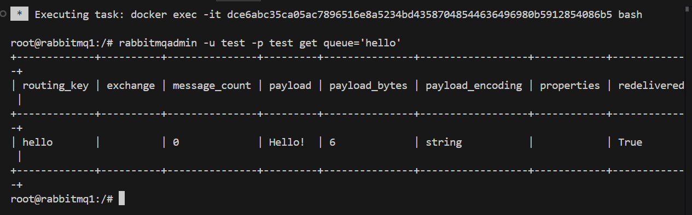
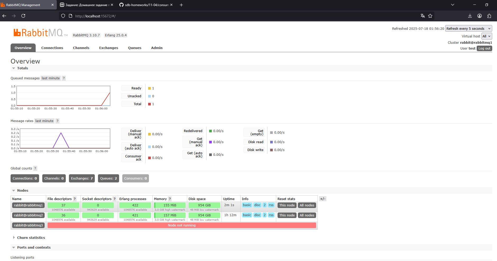

# Домашнее задание к занятию «Очереди RabbitMQ»

---

### Задание 1 Установка RabbitMQ

Используя Vagrant или VirtualBox, создайте виртуальную машину и установите RabbitMQ. Добавьте management plug-in и зайдите в веб-интерфейс.
*Итогом выполнения домашнего задания будет приложенный скриншот веб-интерфейса RabbitMQ.*

### Решение 1

В работе использовал docker для настройки RMQ.
Успользуя docker compouse и файл [text](docker-compose.yml) поднял несколько контейнеров с брокером очередей RMQ

В одном из контейнеров проброшен порт 15672 для работы с UI и настройки RMQ через Web интерфейс.
Порт 5672 будем использовать для отправки amqp сообщений.
Логинимся в Web интерфейс RMQ используя log/pas по умолчанию: test/test


---

### Задание 2 Отправка и получение сообщений

Используя приложенные скрипты, проведите тестовую отправку и получение сообщения.
Для отправки сообщений необходимо запустить скрипт producer.py.

Для работы скриптов вам необходимо установить Python версии 3 и библиотеку Pika.
Также в скриптах нужно указать IP-адрес машины, на которой запущен RabbitMQ, заменив localhost на нужный IP.

```shell script
$ pip install pika
```

Зайдите в веб-интерфейс, найдите очередь под названием hello и сделайте скриншот.
После чего запустите второй скрипт consumer.py и сделайте скриншот результата выполнения скрипта

*В качестве решения домашнего задания приложите оба скриншота, сделанных на этапе выполнения.*

Для закрепления материала можете попробовать модифицировать скрипты, чтобы поменять название очереди и отправляемое сообщение.


### Решение 2

- Используя скрипт [producer.py](producer.py) (описание URI для подключения вынесено в [settings.py](settings.py)) создал очередь *hello* в которую было добавлено сообщение *Hello!*:

- В UI RabbitMQ находим очередь hello и нажимаем Get Message(s) с количеством 1

Получаем Payload "Hello!"
Сообщение успешно положено в очередь RMQ.

-  Используя скрипт [consumerNew.py](consumerNew.py) забрали сообщение из очереди и получили текст "Hello" в терминале:

- В UI RabbitMQ находим очередь hello и нажимаем Get Message(s) с количеством 1:

Получаем сообщение, что очередь пуста. 

---

### Задание 3 Подготовка HA кластера

Используя Vagrant или VirtualBox, создайте вторую виртуальную машину и установите RabbitMQ.
Добавьте в файл hosts название и IP-адрес каждой машины, чтобы машины могли видеть друг друга по имени.

Пример содержимого hosts файла:
```shell script
$ cat /etc/hosts
192.168.0.10 rmq01
192.168.0.11 rmq02
```
После этого ваши машины могут пинговаться по имени.

Затем объедините две машины в кластер и создайте политику ha-all на все очереди.

*В качестве решения домашнего задания приложите скриншоты из веб-интерфейса с информацией о доступных нодах в кластере и включённой политикой.*

Также приложите вывод команды с двух нод:

```shell script
$ rabbitmqctl cluster_status
```

Для закрепления материала снова запустите скрипт producer.py и приложите скриншот выполнения команды на каждой из нод:

```shell script
$ rabbitmqadmin get queue='hello'
```

После чего попробуйте отключить одну из нод, желательно ту, к которой подключались из скрипта, затем поправьте параметры подключения в скрипте consumer.py на вторую ноду и запустите его.

*Приложите скриншот результата работы второго скрипта.*


### Решение 3

- Запускаем в контейнерах три экземпляра "ноды" RMQ (конфиг файл для RMQ кластера [rabbitmq.conf](rabbitmq.conf) с добавленными нодами)
- Включаем репликацию:
1) открываем веб интерфейс RabbitMQ http://localhost:15672/ и переходим на вкладку Admin>Policies


2) открываем блок Add / update a policy и заполняем его:


3) нажимаем опку add / update policiy
4) проверяем настройки репликиции на вкладке Exchanges:

В колонке Features отображается политика ha-all

- Переходим общую вкладку и смотрим доступность нод в кластере:


- Выполнил команду *cluster_status* на первой и второй нодах:
```shell script
$ rabbitmqctl cluster_status
```


Полный текст вывода в файле [cluster_status.txt](cluster_status.txt) 


- Снова запускаем скрипт producer.py:


- Выполняем команду на каждой ноде:
```shell script
$ rabbitmqadmin -u test -p test get queue='hello'
```



- Отключаем ноду RMQ



- Выполняем скрипт [consumerNew.py](consumerNew.py):

Получаем текст "Hello!"
- Выполняем команду на произвольной ноде:
```shell script
$ rabbitmqadmin -u test -p test get queue='hello'
```

Сообщений в очереди нет

---