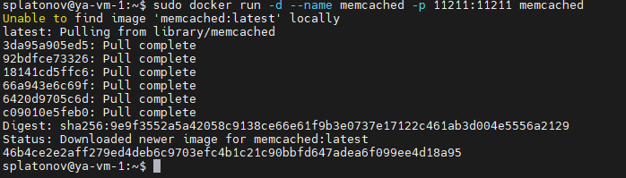
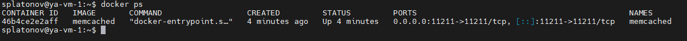
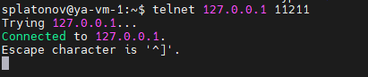
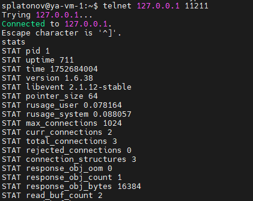
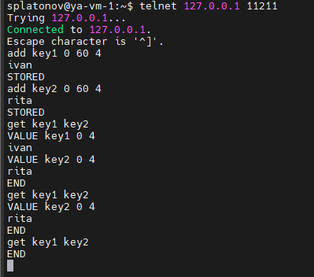
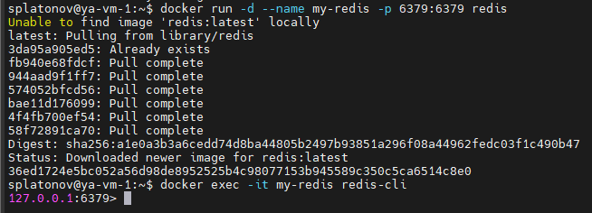
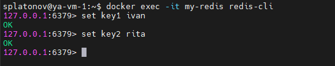
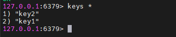

# Домашнее задание к занятию «Кеширование Redis/memcached»

---

### Задание 1 Кеширование

Приведите примеры проблем, которые может решить кеширование.
Приведите ответ в свободной форме.

### Решение 1

Кеширование —  механизм хранения часто используемых данных в быстром доступе (например, в оперативной памяти), чтобы ускорить повторные обращения к ним. 
Примеры проблем которые могут быть решены кешированием:

1) Медленные запросы к базе данных
Если приложение часто выполняет одни и те же сложные или ресурсоёмкие запросы к базе данных, то кеширование результатов этих запросов позволяет значительно снизить нагрузку на базу и ускорить работу приложения.

2) Высокая нагрузка на внешний API
Если приложение обращается к стороннему API (например, для получения курса валют или прогноза погоды, геокодирования адресов и тп), кеширование ответов позволяет уменьшить количество запросов к внешнему сервису, снизить задержки и экономить деньги, если API платный.

3) Генерация динамических страниц
При генерации страниц с большим количеством вычислений или агрегаций (например, главная страница новостного портала), кеширование готовых HTML-страниц или их частей позволяет быстро отдавать их пользователям без повторных вычислений.

4) Часто используемые данные
Если есть данные, которые редко меняются, но часто запрашиваются, их можно закешировать, чтобы не обращаться к базе данных каждый раз.

5) Снижение времени отклика
Кеширование помогает сделать отклик приложения быстрее, что особенно важно для высоконагруженных систем и приложений с большим количеством пользователей.

6) Снижение нагрузки на серверы
Кеширование уменьшает количество операций, которые сервер должен выполнять, что позволяет обслуживать больше пользователей без увеличения ресурсов.


---

### Задание 2 Memcached

Установите и запустите memcached.
Приведите скриншот, где будет видно, что memcached запущен.

### Решение 2

- Устанавливаем memcached используя docker и пробрасываем порт приложения наружу контейнера:
```python
docker run -d --name memcached -p 11211:11211 memcached
```

```python
docker ps
``` 


- Подключаемся по telnet к memcached используя стандартный порт 11211:
```python
telnet 127.0.0.1 11211
```

```python
stats
```


---

### Задание 3 Удаление по TTL в Memcached

Запишите в memcached несколько ключей с любыми именами и значениями, для которых выставлен TTL 5.
Приведите скриншот, на котором видно, что спустя 5 секунд ключи удалились из базы.


### Решение 3

- Подключаемся к memcached и создаем 2 ключа key1 и key2 со значениями ivan и rita. Задаем TTL 60 секунд (чтобы было время сделать скриншоты):
```python
add key1 0 60 4
ivan
```
```python
add key2 0 60 4
rita
```
проверяем наличие ключей:
```python
get key1 key2
```

Записи удалились по истечению заданного времени.
---

### Задание 4 Запись данных в Redis

Запишите в Redis несколько ключей с любыми именами и значениями.
Через redis-cli достаньте все записанные ключи и значения из базы, приведите скриншот этой операции.

### Решение 4

- Запускаем Redis в docker
```python
docker run -d --name my-redis -p 6379:6379 redis
```
- Подключаемся к Redis через redis-cli:
```python
docker exec -it my-redis redis-cli
```


- Записываем 2 ключа key1 и key2 со значениями ivan и rita:
```python
set key1 ivan
```
```python
set key2 rita
```


- Достаем записанные ранее значения:
```python
keys *
```



---