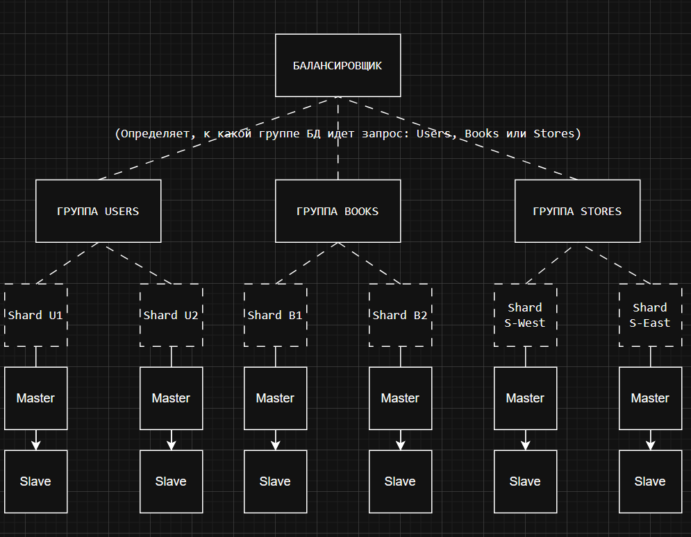

# Домашнее задание к занятию «Репликация и масштабирование. Часть 2»

### Задание 1

Опишите основные преимущества использования масштабирования методами:

- активный master-сервер и пассивный репликационный slave-сервер; 
- master-сервер и несколько slave-серверов;

*Дайте ответ в свободной форме.*

### Решение 1

Репликация master-slave больше относится к надежности и доступности сервиса, чем к масштабирования.. Однако можно выделтьь некоторые моменты позволяющие распределить нагрузку и выиграт в ресурсах на каждом отдельном серевере.

1. активный master-сервер и пассивный репликационный slave-сервер; 

В данной конфигурации вся нагрузка (и чтение, и запись) идет на Master. Slave-сервер находится в режиме ожидания (standby), получая данные от мастера, но не обрабатывая запросы клиентов напрямую.

Основные преимущества:

- Отказоустойчивость (High Availability). Если Master-сервер выйдет из строя (сбой «железа», падение ОС), систему можно быстро переключить на Slave-сервер, сделав его новым Мастером (процедура Failover). Это минимизирует время простоя сервиса.
- Безопасность данных: Slave служит актуальной «горячей» копией данных. В случае фатального повреждения дисков на Мастере, данные сохранятся на Slave-сервере.
- Техническое обслуживание без простоя: На пассивном Slave-сервере можно выполнять тяжелые операции обслуживания (например, создание «холодных» бэкапов, проверка целостности данных или обновление ПО), не нагружая при этом основной боевой сервер (Master).
- Простота обслуживания.

2. Master-сервер и несколько slave-серверов;

В этой конфигурации обычно используется разделение нагрузки: запись идет только в Master, а чтение распределяется между Slave-серверами.

Основные преимущества:

- Масштабирование чтения (Read Scaling). Особенно хорошо для read-heavy систем (где операций чтения намного больше, чем записи). Перенаправление SELECT запросов на группу Slave-серверов существенно разгружается Master. Это позволяет Master серверу эффективнее обрабатывать операции записи (INSERT, UPDATE, DELETE).
- Выделение ресурсов под аналитику. Один из Slave-серверов можно выделить исключительно под тяжелые аналитические запросы и генерацию отчетов. Это гарантирует, что построение сложного отчета не «положит» основной Master и не замедлит работу обычных пользователей.
- Географическое распределение. При условии, что Web сервис и Slave-серверы расположены географически в одном месте и плиже к пользователям. Это может снизить сетевые задержки (latency) при чтении данных для клиентов из соответствующих регионов.

---

### Задание 2

Разработайте план для выполнения горизонтального и вертикального шардинга базы данных. База данных состоит из трёх таблиц: 

- пользователи, 
- книги, 
- магазины (столбцы произвольно). 

Опишите принципы построения системы и их разграничение или разбивку между базами данных.

*Пришлите блоксхему, где и что будет располагаться. Опишите, в каких режимах будут работать сервера.* 

### Решение 2

1. Вертикальный шардинг (Функциональное разбиение)

Разделение данных по функциональным доменам (микросервисный подход). 

Выносим разные таблицы в физически разные базы данных.
Так как логика работы с пользователями, каталогом книг и физическими магазинами редко пересекается в одном JOIN-запросе разделение будет слудующим:
- DB_Users (Пользователи): Высокая нагрузка на чтение (авторизация) и запись (регистрация, изменение профиля).
- DB_Books (Книги): Очень высокая нагрузка на чтение (поиск, просмотр), редкая запись.
- DB_Stores (Магазины): Умеренная нагрузка, часто географически зависимая.

2. Горизонтальный шардинг (Масштабирование данных)

Разбиение одной таблицы на части (шарды) внутри одного функционального домена. 

Выносим строки исходной таблицы (части) в шарды на другие физические хосты, распределяя БД на несколько серверов:

- Шардинг «Пользователи» (DB_Users)
Цель: Равномерное распределение нагрузки при авторизации и создании новых пользователей.
Ключ шардирования (Shard Key): user_id.
Метод: Хэширование (Hash-based) / Модульное (Modulo).
Пример: Используется формула user_id % n, где n — количество шардов (2 сервера). 
Если результат деления на 2 дает остаток 1 -> Server A, Shard-U1 (Нечетные): пользователи с ID 1, 3, 5, 7...
Если результат деления на 2 дает остаток 0 -> Server B, Shard-U2 (Четные): пользователи с ID 2, 4, 6, 8...

- Шардинг «Книги» (DB_Books)
Цель: Обеспечить максимально равномерное заполнение дискового пространства всех серверов и распределить нагрузку запросов, избегая «горячих точек» (hotspots).
Ключ шардирования (Shard Key): book_id.
Метод: Хэширование (Hash-based). Равномерное распределение каталога.
Пример: Используется функция остатка от деления (Modulo): book_id % 3 (при наличии 3 серверов).
Если результат 0 -> запись идет на Server C, Shard-B1.
Если результат 1 -> запись идет на Server D, Shard-B2.

- Шардинг «Магазины» (DB_Stores)
Цель: Магазины Москвы хранятся на сервере, который физически ближе к Москве, магазины Владивостока — на сервере ближе к Владивостоку. Это ускорит доступ к данным при условии, что сервер приложения и сервер СУБД находятся территориально в одном месте.
Ключ шардирования: city_id.
Метод: Географический шардинг (Geo-sharding).
Пример: На уровне приложения или прокси настроена карта маршрутизации:
Если запросы с city_id = 77 (Москва) и 50 (МО) -> направляются на сервер в ДЦ «Москва», Shard S-West.
Если запросы с city_id = 25 (Владивосток) и 27 (Хабаровск) -> направляются на сервер в ДЦ «Дальний Восток», Shard S-East.

Блоксхема архитектуры:

Предполагается наличие слоя приложения или middleware, который знает, в какой шард отправлять запрос.
Каждый шард (например, Shard U1 или Shard B2) представляет собой не одиночный сервер, а кластер высокой доступности (HA-cluster).
Master: Активный сервер для записи и критического чтения.
Slave: Пассивный сервер для репликации и распределения чтения.

---

